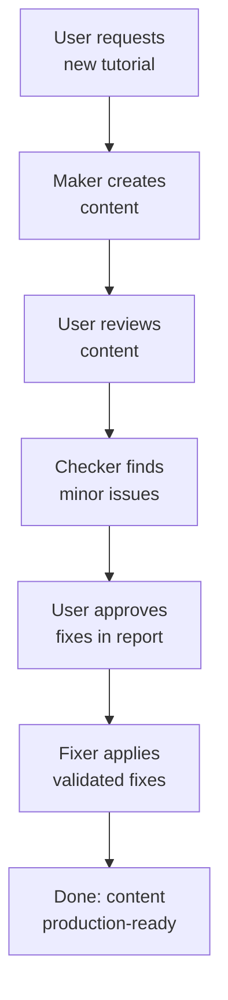
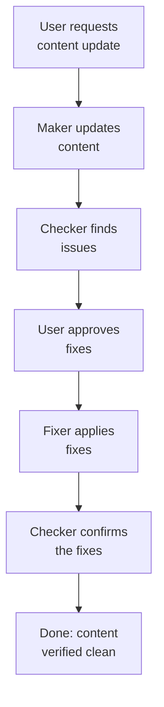
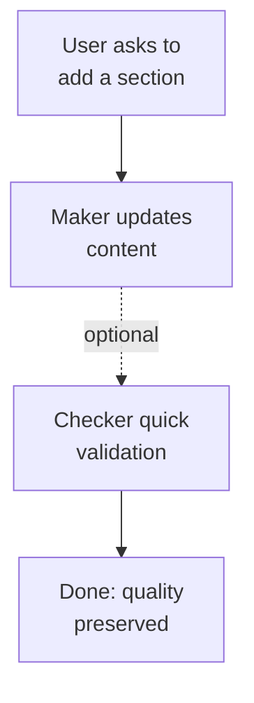

# Common Workflows

## Basic Workflow: Create → Validate → Fix

**Scenario**: Creating new content from scratch



The maker creates the content together with all its dependencies.

**Example**:

```bash
# Step 1: Create content
User: "Create TypeScript generics tutorial for ayokoding-www"
Agent: apps-ayokoding-www-general-maker (creates tutorial + navigation updates)

# Step 2: Validate
User: "Check the new tutorial"
Agent: apps-ayokoding-www-general-checker (generates audit report)

# Step 3: Fix
User: "Apply the fixes"
Agent: apps-ayokoding-www-general-fixer (applies validated fixes from audit)
```

## Iterative Workflow: Maker → Checker → Fixer → Checker

**Scenario**: Major content update requiring validation of fixes



The maker updates the content together with its dependencies.

**When to use**: Critical content, major refactoring, or when fixer confidence is uncertain

## Update Workflow: Maker (update mode) → Checker

**Scenario**: Updating existing content that's already high quality



The content was already validated during creation, so the quick check is only a confirmation.

**When to use**: Minor updates to well-maintained content
