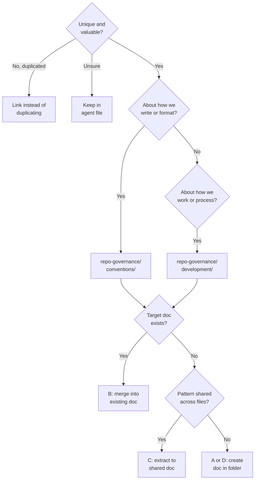

# The Offload Decision Tree

When condensing content, ask these questions:

Option A creates a new document, and Option D adds the content to the appropriate folder (`conventions/` or
`development/`). Duplicated content links to the existing convention or development document, and unsure,
agent-specific implementation stays in the agent file.
