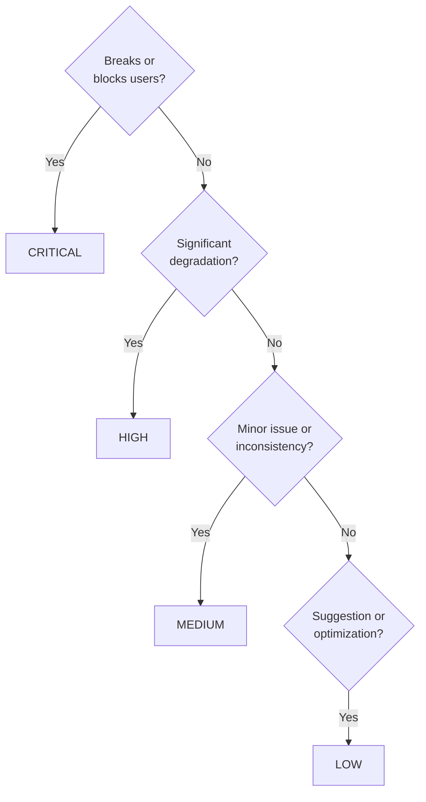

# Implementation Guidelines for Checker Agents

## Assessment Decision Tree

When categorizing a finding, use this decision tree:



CRITICAL covers anything that breaks functionality or blocks users. HIGH also covers any violation of a documented
convention, MEDIUM covers style inconsistencies, and LOW also covers future considerations.

## Context-Specific Adjustments

**Build/Compilation Breaking**:

- Always CRITICAL (blocks deployment)

**Security/Privacy**:

- Always CRITICAL (blocks deployment)

**Accessibility Violations**:

- WCAG A violations: CRITICAL
- WCAG AA violations: HIGH
- WCAG AAA violations: MEDIUM

**Link Status**:

- 404 on critical reference: CRITICAL
- 404 on optional reference: HIGH
- Redirect working: MEDIUM
- Slow loading: LOW

**Factual Errors**:

- Command won't run: CRITICAL
- Outdated major version with breaking changes: HIGH
- Outdated minor version (compatible): MEDIUM
- Alternative approach not mentioned: LOW

**Convention Violations**:

- MUST requirement: CRITICAL
- SHOULD requirement: HIGH
- MAY/OPTIONAL requirement: MEDIUM
- Style preference: LOW

## Progressive Writing Pattern

**MANDATORY**: All checker agents MUST write reports progressively throughout execution.

**Why**: Long validation runs may exceed context limits. Progressive writing ensures audit history survives context compaction.

**How**:

1. **Initialize report at execution start**:

```bash
# Create report file immediately
REPORT_FILE="local-tmp/${AGENT_FAMILY}/${AGENT_FAMILY}__${UUID_CHAIN}__${TIMESTAMP}__audit.md"

# Write header
cat > "$REPORT_FILE" <<'EOF'
# Agent Name Audit Report

**Audit ID**: uuid__timestamp
**Scope**: scope-description
**Audit Start**: timestamp
**Files Checked**: TBD (will update)

## Executive Summary
(Findings counts will be updated as we progress)

---

## CRITICAL Issues (Must Fix)

**Count**: 0 issues (updating progressively)

---
EOF
```

1. **Append findings as discovered**:

```bash
# Append each finding immediately when found
cat >> "$REPORT_FILE" <<EOF

### ${FINDING_NUM}. ${ISSUE_TITLE}

**File**: \`${FILE_PATH}:${LINE_NUM}\`
**Criticality**: CRITICAL - ${JUSTIFICATION}
**Category**: ${CATEGORY}

**Finding**: ${DESCRIPTION}
**Impact**: ${IMPACT}
**Recommendation**: ${FIX}

**Confidence**: HIGH

---
EOF
```

1. **Update summary at completion**:

```bash
# Update executive summary with final counts
# (Use sed or similar to replace TBD values)
```

**Key Point**: Never buffer all findings in memory and write once at end. Write incrementally.

---
