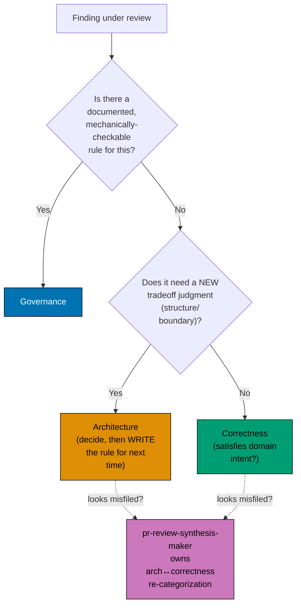

# The Boundary Tie-Breaker Rule

When a finding does not obviously belong to one of the nine disciplines above, resolve it with
this **tie-breaker**, in order:

1. **Documented + mechanically-checkable rule → governance.** If a `repo-governance/` convention
   already states the rule and a mechanical check (grep, linter, structural check) could in
   principle confirm the violation, the finding is governance's.
2. **New tradeoff judgment → architecture** (resolve by making the call, then writing the rule for
   next time). If answering the finding requires a genuinely new structural or quality-attribute
   decision that no existing rule covers, it is architecture's — and the resolution should be
   written down as a new rule so the next occurrence falls under bullet 1 instead.
3. **"Does it satisfy domain intent?" → correctness.** If neither of the above applies, and the
   question is whether the change actually does what the domain requires, it is correctness's
   (owned by `pr-review-logic-maker`).

The **architecture↔correctness boundary is the highest-risk of the three** — a new structural
decision and a domain-behaviour question can look identical in a raw finding. The coordinator
(`pr-review-synthesis-maker`) **owns re-categorizing a misfiled finding across this specific
boundary** as part of its re-categorize function; no specialist self-adjudicates its own
tie-breaker verdict once the coordinator has reviewed it. This is the same tie-breaker every
grey-zone ruling below applies — the seven rulings are this rule pre-resolved for seven recurring
cases so the coordinator does not have to re-derive the tie-breaker from scratch every cycle.

