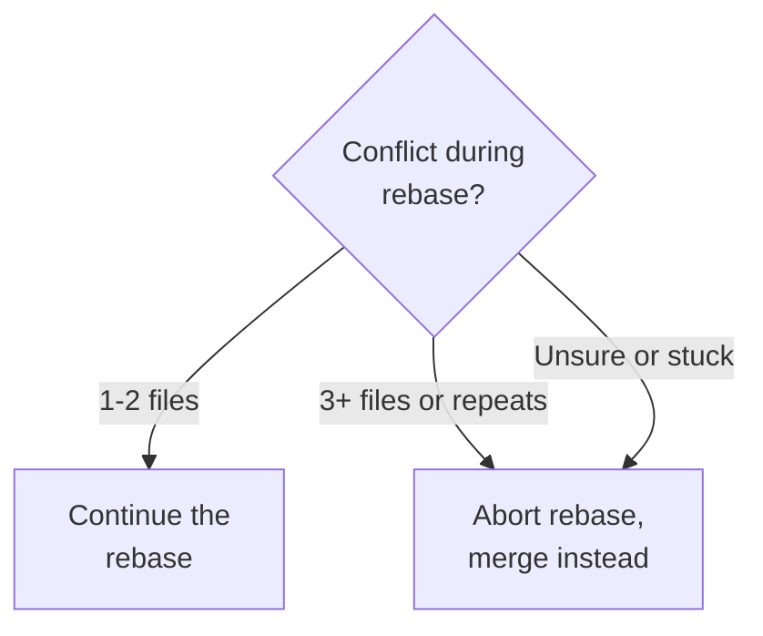

# Conflict Resolution Workflows

## Resolving Rebase Conflicts

**Rebase applies commits one at a time**, so conflicts are resolved incrementally:

```bash
# Start rebase
git pull --rebase origin main

# Conflict in first commit being replayed
# CONFLICT (content): Merge conflict in src/auth.ts
# error: could not apply abc1234... feat(auth): add validation

# Resolve conflict in the file
# ... edit src/auth.ts to resolve conflict ...

# Stage the resolved file
git add src/auth.ts

# Continue rebase to next commit
git rebase --continue

# If another conflict appears, repeat:
# - Resolve conflict
# - git add <file>
# - git rebase --continue

# If too many conflicts, abort and use merge instead
git rebase --abort
git pull origin main  # Falls back to merge
```

**Rebase workflow**:

1. Conflict appears for ONE commit at a time
2. Resolve conflict
3. `git add` resolved files
4. `git rebase --continue`
5. Repeat until all commits applied
6. Or `git rebase --abort` to start over

## Resolving Merge Conflicts

**Merge resolves all conflicts at once** in a single merge commit:

```bash
# Start merge
git pull origin main  # Default merge strategy

# Conflicts in multiple files
# CONFLICT (content): Merge conflict in src/auth.ts
# CONFLICT (content): Merge conflict in src/user.ts
# Automatic merge failed; fix conflicts and then commit the result.

# Resolve ALL conflicts in ALL files
# ... edit src/auth.ts ...
# ... edit src/user.ts ...

# Stage all resolved files
git add src/auth.ts src/user.ts

# Complete the merge with a merge commit
git commit -m "Merge remote-tracking branch 'origin/main'"

# Push merged result
git push origin main
```

**Merge workflow**:

1. All conflicts appear at once
2. Resolve all conflicts
3. `git add` all resolved files
4. `git commit` to complete merge
5. Creates one merge commit

## Decision Tree: Rebase vs Merge Conflicts



Resolve a continued rebase commit by commit. To switch to a merge, run `git rebase --abort` and then
`git pull origin main`; merging is the safer choice when unsure or stuck, or when the same file conflicts more
than once.
