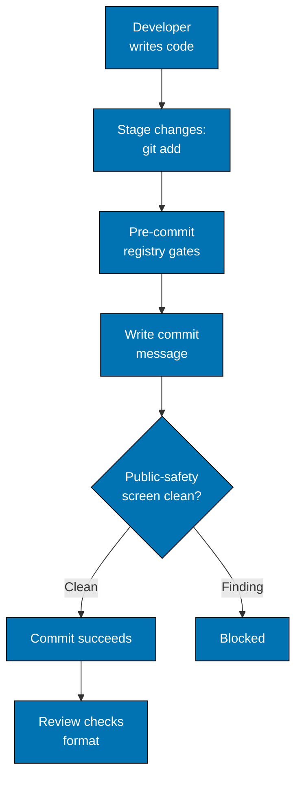

# How It's Checked

No hook or CI step enforces the Conventional Commits format. Reviewers check it. A Commitlint
configuration is kept so you can check a message yourself before committing.

## What the Hooks Run

**Hook**: `.husky/commit-msg`, which runs
`./rhino gate run --surface commit-msg --message-file "$1"` under the `./hippo` guard.

**What it runs**: the only gate declared on the `commit-msg` surface, `public-safety-commit-message`.
It screens the message for the public-safety shapes this public repository must never publish, such
as absolute home paths and private addresses. It does not check type, scope, case, or length.

The `pull-request` surface in `pr-quality-gate.yml` runs the same gate over the PR's commit range.
List the live gate set with `./rhino gate list` rather than trusting this page.

**Example block** (the screen names a detector and a line, never the matched value):

```text
[public-safety] finding maintainer-path <commit-text-1>:1
[public-safety] commit: blocked, 1 finding(s); publication must not proceed
```

## Commitlint (On Demand)

**Tool**: [@commitlint/config-conventional](https://github.com/conventional-changelog/commitlint).
`@commitlint/cli` and `@commitlint/config-conventional` are pinned devDependencies in `package.json`.

**Configuration**: `commitlint.config.js`

```javascript
module.exports = {
  extends: ["@commitlint/config-conventional"],
};
```

**Note for Node.js 24+**: Node v24 introduced changes to module loading. Ensure:

- Project has `package.json` (this project uses npm workspaces )
- Or rename config to `commitlint.config.mjs` if using ES6 modules

**Run it yourself** against a message file; it exits 1 on a violation:

```bash
./hippo run --class ephemeral --resource-tier light --disk-path . -- \
  npm exec -- commitlint --edit <message-file>
```

**Validates:**

- Commit message format
- Valid types
- Description presence
- Character limits

**Example error:**

```bash
⧗   input: Added new feature
   subject may not be empty [subject-empty]
   type may not be empty [type-empty]

   found 2 problems, 0 warnings
ⓘ   Get help: https://github.com/conventional-changelog/commitlint/#what-is-commitlint
```

## Workflow



The pre-commit hook runs the registry gates, including staged formatting, and the commit-msg hook
runs the public-safety screen on the message. Conventional Commits format is left to review, with
Commitlint available on demand.
