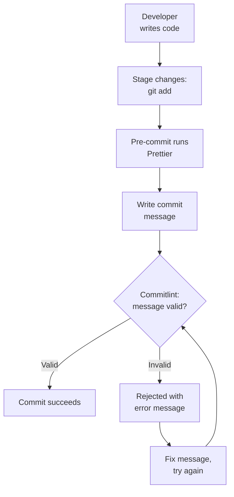

# How It's Enforced

The project uses automated tools to ensure all commits follow the convention:

## Commitlint

**Tool**: [@commitlint/config-conventional](https://github.com/conventional-changelog/commitlint)

**Configuration**: `commitlint.config.js`

```javascript
module.exports = {
  extends: ["@commitlint/config-conventional"],
};
```

**Note for Node.js 24+**: Node v24 introduced changes to module loading. Ensure:

- Project has `package.json` (this project uses npm workspaces )
- Or rename config to `commitlint.config.mjs` if using ES6 modules

**Validates:**

- Commit message format
- Valid types
- Description presence
- Character limits

## Husky Git Hook

**Hook**: `.husky/commit-msg`

**When it runs**: After you write a commit message, before the commit is created

**What it does:**

1. Intercepts the commit message
2. Runs `commitlint` to validate format
3. Rejects the commit if validation fails
4. Provides helpful error message

**Example error:**

```bash
⧗   input: Added new feature
   subject may not be empty [subject-empty]
   type may not be empty [type-empty]

   found 2 problems, 0 warnings
ⓘ   Get help: https://github.com/conventional-changelog/commitlint/#what-is-commitlint
```

## Workflow



The pre-commit hook formats files with Prettier, and the commit-msg hook runs Commitlint on the message.
