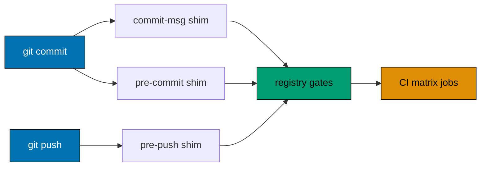

# Git Hook Lifecycle

The three Husky files are deliberately thin shims. The checked-in gate registry in
[`repo-config.yml`](../../../repo-config.yml) is the normative source for their command inventory,
scope, order, and CI relationship. Do not copy a command list into a hook or this document.

## Discover the current gate set

Use the registry projection for the repository and surface being inspected:

```sh
./rhino gate list
./rhino gate validate
```

`gate validate` is the conformance check: it rejects a declared hook surface whose executable shim
does not delegate to the registry, a stale generated `lint-staged` block, or invalid CI wiring.

## Hook shims

| Git event      | Shim                | Delegation                                      |
| -------------- | ------------------- | ----------------------------------------------- |
| Commit message | `.husky/commit-msg` | `./rhino gate run --surface commit-msg -- "$1"` |
| Before commit  | `.husky/pre-commit` | `./rhino gate run --surface pre-commit`         |
| Before push    | `.husky/pre-push`   | `./rhino gate run --surface pre-push`           |

The pinned RHINO binary runs the public-safety screen first, then hands the surface to the registry
through `./rhino gate run --surface <surface>`.

The dispatcher runs each declared gate in registry order and stops at the first failure. A hook failure
aborts its Git operation; fix the reported gate and retry.



## Pre-commit generation boundary

The pre-commit dispatcher has one declaration-positioned `lint-staged` batch for eligible
file-scoped formatters and checks. `gate emit --surface=pre-commit` regenerates its
`package.json` block from the registry. Direct mutations (platform-binding generation, lockfile
sync) stay declared registry entries, run in order after the batch.

Do not hand-edit the generated block; regenerate, then `gate validate`.

## CI relationship

Pre-commit runs deterministic staged checks only. Pre-push and PR/main quality gates run affected
`test:quick` targets serially plus their declared repository validation. Quick includes Unit runtime
for every behaviour owner and all applicable static `test:coverage:*` validators. Neither hook nor
PR/main may invoke Integration or E2E runtime directly or transitively.

CI derives registry-managed entries from `gate list --output json`. Jobs needing
language-specific setup remain `wiring: hand-wired`; validation requires each declared command.
Scheduled/manual full-quality workflows own complete Integration and E2E execution.

Formatting mutations run locally and the PR formatter can commit fixes. Every formatter also has one
CI-only `format-verify-*` check linked by `verifies`, so pushed code is independently verified.

## Bypass policy

Skipping hooks with `--no-verify` needs explicit authorization that names the bypass for that one
operation, as [Git Push Safety](git-push-safety.md) requires. A request to commit or push never
implies it, and there is no emergency or CI-blocker-investigation exception. A bypass does not remove
the CI gate, and it must never be used to avoid fixing a registry, generated-artifact, or hook
conformance failure.

See [SDLC Gate Standard](../../../docs/reference/sdlc-gate-standard.md) for the governing rule and
[CI blocker resolution](../quality/ci-blocker-resolution.md) for investigation procedure.

## Principles Implemented/Respected

- [Automation Over Manual](../../principles/software-engineering/automation-over-manual.md) — hooks
  and CI run the declared checks automatically.
- [Explicit Over Implicit](../../principles/software-engineering/explicit-over-implicit.md) — the
  registry owns gate IDs, ordering, scope, and lifecycle surfaces.
- [Reproducibility](../../principles/software-engineering/reproducibility.md) — local and CI
  projections derive from the same declaration.

## Conventions Implemented/Respected

- [Specs Directory Structure](../../conventions/structure/specs-directory-structure.md) — its
  structural and Gherkin checks are projected through this lifecycle.
- [Governance Word Budget](../../conventions/structure/governance-word-budget.md) — its pre-push and
  CI enforcement points are registry-owned.
