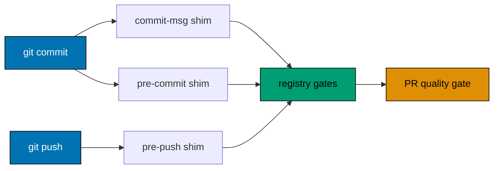

# Git Hook Lifecycle

The three Husky files are deliberately thin shims. The checked-in gate registry in
[`repo-config.yml`](../../../repo-config.yml) is the normative source for their command inventory,
scope, order, and CI relationship. Do not copy a command list into a hook or this document.

## Discover the current gate set

Use the registry projection for the repository and surface being inspected:

```sh
./rhino gate list
./rhino gate validate
```

`gate validate` is the conformance check: it validates each gate's lifecycle membership and the
pull-request surface's composition. Nothing is generated from the registry into `package.json`; the
legacy `lint-staged` block was retired on 2026-09-19.

## Hook shims

| Git event      | Shim                | Delegation                                                  |
| -------------- | ------------------- | ----------------------------------------------------------- |
| Commit message | `.husky/commit-msg` | `./rhino gate run --surface commit-msg --message-file "$1"` |
| Before commit  | `.husky/pre-commit` | `./rhino gate run --surface pre-commit`                     |
| Before push    | `.husky/pre-push`   | `./rhino gate run --surface pre-push --push-updates-stdin`  |

Each shim runs its one command inside a `./hippo run` boundary. The public-safety screens are not
built into the shims: they are ordinary registry entries, declared ahead of every other gate on each
surface they join.

The dispatcher runs each declared gate in registry order and stops at the first failure. A hook failure
aborts its Git operation; fix the reported gate and retry.



## Staged paths and formatting

A gate that declares a `files` input receives paths, not the whole tree. At `pre-commit` it binds
the staged index (`source: git-index`); on the `pull-request` surface it binds the pull request's
changed range (`source: explicit-range`). Each gate's command selects the file types it owns from
those paths, so one declaration serves both surfaces.

Formatting is one `mutation` gate, `format-staged`, which calls `scripts/format-staged` to pick each
path's formatter by extension. Locally (`mutation.local: apply-index`) Rhino applies the formatted
bytes to the index; on the pull-request surface (`mutation.ci: verify-clean`) it replays the
formatter and fails if any byte would change. CI never commits formatter fixes.

## CI relationship

Pre-commit runs deterministic checks only. Pre-push runs only its declared gates; neither hook
runs `test:quick`. The `pr-quality-gate.yml` workflow, on every pull request and push to `main`,
runs the `pull-request` surface in its `Repository policy` job through
`./rhino gate run --surface pull-request --base <sha> --head <sha>`, and runs affected
`typecheck`, `lint`, and `test:quick` in its language-detected jobs. Quick includes Unit runtime
for every behaviour owner and all applicable static `test:coverage:*` validators. Neither a hook
nor PR/main may invoke Integration or E2E runtime directly or transitively; scheduled/manual
full-quality workflows own complete Integration and E2E execution.

## Bypass policy

Skipping hooks with `--no-verify` needs explicit authorization that names the bypass for that one
operation, as [Git Push Safety](git-push-safety.md) requires. A request to commit or push never
implies it, and there is no emergency or CI-blocker-investigation exception. A bypass does not remove
the CI gate, and it must never be used to avoid fixing a registry, generated-artifact, or hook
conformance failure.

See [SDLC Gate Standard](../../../docs/reference/sdlc-gate-standard.md) for the governing rule and
[CI blocker resolution](../quality/ci-blocker-resolution.md) for investigation procedure.

## Principles Implemented/Respected

- [Automation Over Manual](../../principles/software-engineering/automation-over-manual.md) — hooks
  and CI run the declared checks automatically.
- [Explicit Over Implicit](../../principles/software-engineering/explicit-over-implicit.md) — the
  registry owns gate IDs, ordering, scope, and lifecycle surfaces.
- [Reproducibility](../../principles/software-engineering/reproducibility.md) — local and CI
  projections derive from the same declaration.

## Conventions Implemented/Respected

- [Specs Directory Structure](../../conventions/structure/specs-directory-structure.md) — its
  structural and Gherkin checks are projected through this lifecycle.
- [Governance Word Budget](../../conventions/structure/governance-word-budget.md) — its pre-push and
  CI enforcement points are registry-owned.
