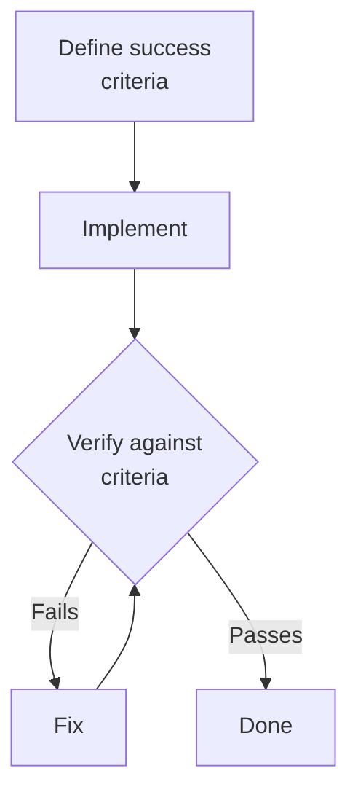

# Goal-Driven Execution — Verification and Iteration

## Verification-First Development (Test-Driven)

**Pattern**:

1. **Write the test first** (defines success)
2. **Run the test** (verify it fails)
3. **Implement** (make it pass)
4. **Run the test again** (verify it passes)
5. **Refactor** if needed (verify tests still pass)

### Example: Adding Email Validation

**Step 1: Write the test**

```typescript
describe("validateEmail", () => {
  it("accepts valid email", () => {
    expect(validateEmail("user@example.com")).toBe(true);
  });

  it("rejects email without @", () => {
    expect(validateEmail("userexample.com")).toBe(false);
  });

  it("rejects empty string", () => {
    expect(validateEmail("")).toBe(false);
  });
});
```

**Step 2: Run test (expect failure)**

```bash
$ npm test
FAIL: validateEmail is not defined
```

**Step 3: Implement**

```typescript
function validateEmail(email: string): boolean {
  return email.includes("@") && email.length > 0;
}
```

**Step 4: Run test again (expect success)**

```bash
$ npm test
PASS: All tests passed
```

**Step 5: Refactor (if needed)**

```typescript
function validateEmail(email: string): boolean {
  return /^[^\s@]+@[^\s@]+\.[^\s@]+$/.test(email)
}

// Verify tests still pass
$ npm test
PASS: All tests passed
```

## Loop Until Verified

**Anti-pattern (no verification)**:

```
1. Implement feature
2. Assume it works
3. Move on
4. Bug reports later
```

**Goal-driven pattern (continuous verification)**:


