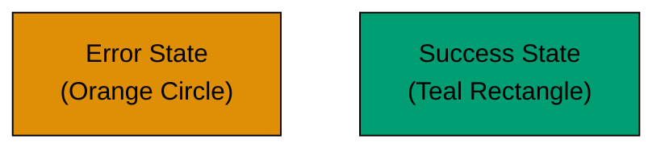

# Anti-Patterns

## Using Color Alone

FAIL: **Problem**: Information conveyed only through color.

```text
graph TD
    A[Task]:::red
    B[Task]:::green

    classDef red fill:#FF0000
    classDef green fill:#00FF00
```

**Why it's bad**: Red-blind and green-blind users cannot distinguish these. Information is lost.

PASS: **Solution**: Combine color with text labels and shapes.



## Missing Alt Text

FAIL: **Problem**: Images without descriptive alt text.

```markdown

```

**Why it's bad**: Screen reader users have no idea what the image shows.

## Red-Green Combinations

FAIL: **Problem**: Using red and green together.

**Why it's bad**: ~99% of color-blind users cannot distinguish red from green. Both appear as brownish-yellow.

## Low Contrast Text

FAIL: **Problem**: Light gray text on white background.

```css
color: #cccccc;
background: #ffffff;
/* Contrast: 1.6:1 - FAILS WCAG AA */
```

**Why it's bad**: Hard to read for everyone, impossible for vision-impaired users.
