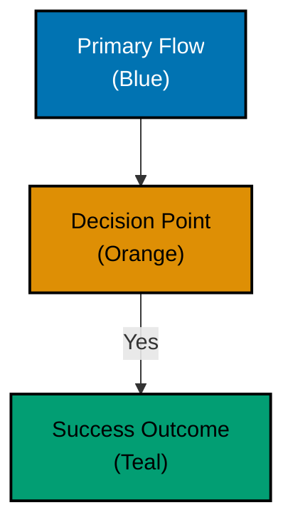

# Examples from This Repository

## Mermaid Diagrams

**Location**: All `docs/` and convention documents



**Accessibility features**:

- PASS: Color-blind friendly palette
- PASS: Black borders for shape definition
- PASS: White text for contrast
- PASS: Text labels describe each element
- PASS: Shape differentiation (rectangle vs diamond)

## AI Agent Categorization

**Location**: `.agents/agents/README.md`

```markdown
### 🟦 docs-maker.md

Expert documentation writer specializing in GitHub-compatible markdown and Diátaxis framework.
```

**Accessibility features**:

- PASS: Colored square emoji (supplementary)
- PASS: Agent name (primary identifier)
- PASS: Description text (semantic meaning)
- PASS: Accessible blue color (#0173B2)
- PASS: Multiple visual cues, not color alone

## Document Frontmatter

**Location**: All markdown documents

```yaml
---
title: "Accessibility First"
description: Design for universal access from the start
category: explanation
tags:
  - principles
  - accessibility
---
```

**Accessibility features**:

- PASS: Descriptive title
- PASS: Clear description for search engines
- PASS: Semantic categorization
- PASS: Machine-readable structure
