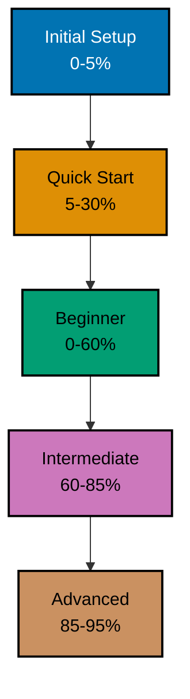

# How It Applies — Tutorial Levels, Diátaxis, and File Naming

## Tutorial Levels

**Context**: Learning paths for technical topics.

**Progressive Structure**:



**Why this works**:

- PASS: **Initial Setup (0-5%)**: Get running in 5 minutes
- PASS: **Quick Start (5-30%)**: Learn enough to explore independently
- PASS: **Beginner (0-60%)**: Comprehensive foundation
- PASS: **Intermediate (60-85%)**: Production-ready skills
- PASS: **Advanced (85-95%)**: Expert-level mastery

**Alternative** (what we avoid):

FAIL: **Single "Complete Guide"**: 1,000 pages covering everything at once. Overwhelming.

## Diátaxis Framework

**Context**: Documentation organization.

**Progressive Structure**:

```
Tutorials → How-To → Reference → Explanation
(Learn)     (Solve)   (Look up)   (Understand)
```

**Why this works**:

- PASS: **Tutorials**: Guided learning for beginners
- PASS: **How-To**: Problem-solving for practitioners
- PASS: **Reference**: Quick lookup for experts
- PASS: **Explanation**: Deep understanding for architects

**Not** a single type of documentation:

FAIL: Everything in one giant README
FAIL: Reference manual for beginners
FAIL: Tutorial for expert lookup

## File Naming Convention

**Context**: File organization system.

**Simple rule**:

```
docs/tutorials/getting-started.md
docs/explanation/conventions/file-naming-convention.md
```

Kebab-case filenames describing the content. Category is conveyed by the directory, not the filename. No lookup tables required to parse a name.

**Why this works**:

- PASS: One rule covers every directory
- PASS: Filenames read as English, not codes
- PASS: No abbreviation tables to memorize

**Alternative** (what we avoid):

FAIL: **Complex classification system**: `L2-CAT3-TYPE1-SUBTYPE4-file.md`

Too complex. No progressive learning.
