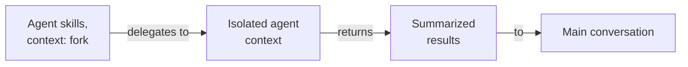

# Agent skills: Fork Delivery and Layer Comparison

## Fork agent skills (Task Delegation)

**Delegation behaviour** with `context: fork`:

**Characteristics**:

- Spawn isolated delegated agent contexts for focused work
- Delegate specialized tasks (research, analysis, exploration)
- Act as lightweight orchestrators
- Return results to main conversation
- Still service relationship (not governance)

**Agent skills Available**:

- **docs-\*** - Documentation creation and quality
- **readme-\*** - README file patterns
- **repo-\*** - Repository-wide patterns
- **swe-programming-\*** - Language/framework expertise
- **swe-developing-\*** - Application development patterns
- **apps-\*** - Application-specific patterns
- **agent-\*** - Agent development and selection
- **plan-\*** - Project planning patterns

**Why agent skills Are NOT Layer 4.5**:

| Aspect                | Governance Layers (L1-L5) | agent skills (Delivery)        |
| --------------------- | ------------------------- | ------------------------------ |
| **Authority**         | Govern behaviour (MUST)   | Serve agents (provide support) |
| **Change Frequency**  | Stable, controlled        | Evolve with agent needs        |
| **Traceability**      | Required sections         | Optional references            |
| **Relationship**      | Hierarchical governance   | Service relationship           |
| **Agent Compliance**  | Agents MUST follow        | Agents MAY use                 |
| **Enforcement**       | Mandatory                 | Optional                       |
| **Purpose**           | Define rules              | Deliver knowledge/tasks        |
| **Delivery Modes**    | N/A                       | Inline or fork                 |
| **Orchestration**     | N/A                       | Fork mode only                 |
| **Context Isolation** | N/A                       | Fork creates isolated contexts |

**Key insight**: agent skills SERVE agents through two modes:

- **Inline skills** - Deliver knowledge from L2/L3 to current conversation
- **Fork skills** - Delegate tasks to agents in isolated contexts
- Neither mode governs agents (service relationship, not governance)
