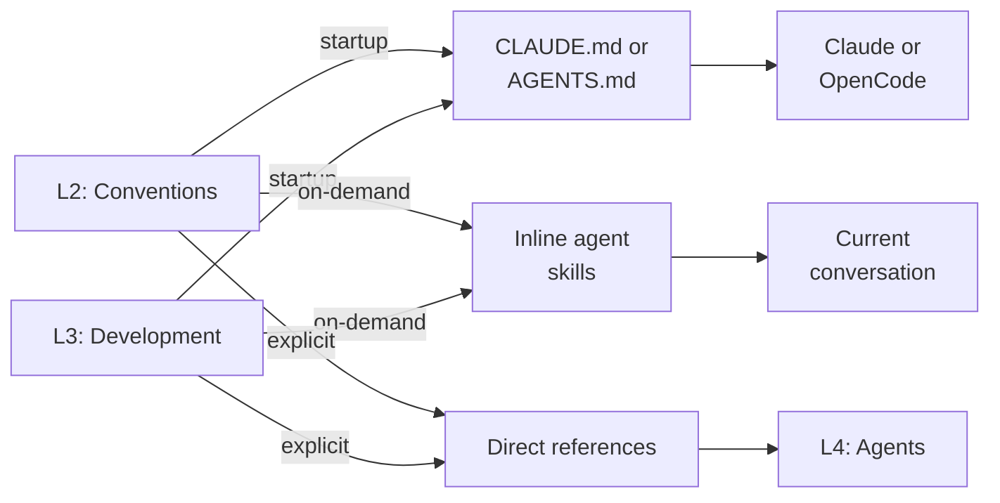

# Agent skills: Delivery Infrastructure (Not a Governance Layer)

**CRITICAL**: agent skills are **delivery infrastructure**, NOT a governance layer.

**Purpose**: Package and deliver knowledge/capabilities to agents in two distinct modes.

**Location**: `.claude/skills/`

**Documentation**: See [`.claude/skills/README.md`](../../.claude/skills/README.md) for skills catalog, or [AGENTS.md](../../AGENTS.md) for root instruction file including skills integration overview

**Two Delivery Modes**:

## Inline agent skills (Knowledge Delivery)

**Default behaviour** - Progressive knowledge injection:

**Characteristics**:

- Progressive disclosure (name/description → full content on-demand)
- Inject convention/development knowledge into current conversation
- Enable knowledge composition (multiple skills work together)
- Serve agents but don't govern them
