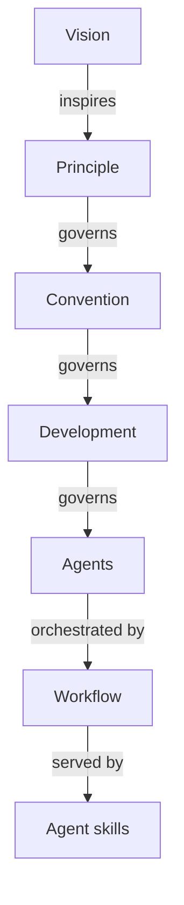

# Complete Traceability Example

## Color Accessibility (Vision → Agents)

**L0 - Vision**: Democratize Islamic enterprise → accessible to everyone

**L1 - Principle**: [Accessibility First](../principles/content/accessibility-first.md)

- **Vision supported**: Accessible tools enable global participation in Shariah-compliant business
- **Key value**: Universal access from the start, not as an afterthought

**L2 - Convention**: [Color Accessibility Convention](../conventions/formatting/color-accessibility.md)

- **Implements**: Accessibility First principle
- **Rule**: Use verified color-blind friendly palette
- **WCAG AA compliance required**

**L3 - Development**: [AI Agents Convention](../development/agents/ai-agents.md)

- **Respects**: Color Accessibility Convention
- **Practice**: Agent colors use accessible palette
- **Implementation**: Frontmatter `color` field limited to verified palette

**L4 - Agents**:

- `docs-checker` - Validates diagram colors in documentation
- `docs-fixer` - Applies color corrections to diagrams
- `agent-maker` - Validates agent frontmatter colors

**L5 - Workflow**: Maker-Checker-Fixer

- Orchestrates: maker → checker → fixer
- Ensures: All diagrams use accessible colors before publication

**Agent skills (Delivery)**:

- `docs-creating-accessible-diagrams` (inline) - Delivers Mermaid diagram patterns with WCAG colors
- Service relationship: Helps agents understand color conventions

**Complete Chain**:

In this chain the vision is to democratize access, the principle is Accessibility First, the convention is Color
Accessibility, and the development rule is the AI Agents Convention. The agents are docs-checker, docs-fixer and
agent-maker, the workflow is Maker-Checker-Fixer, and the skill is docs-creating-accessible-diagrams, delivered as
inline knowledge.
