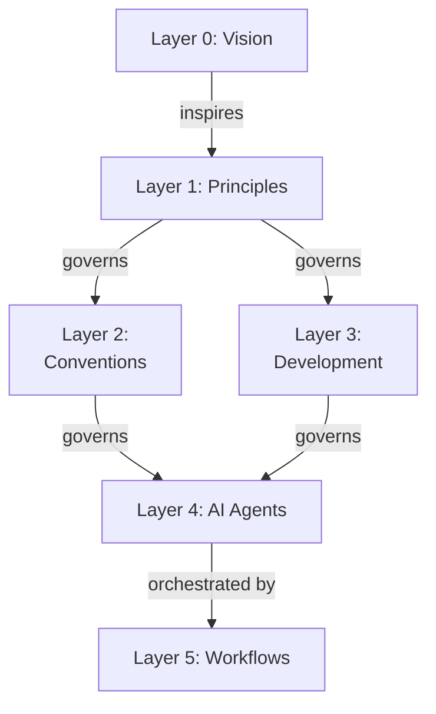
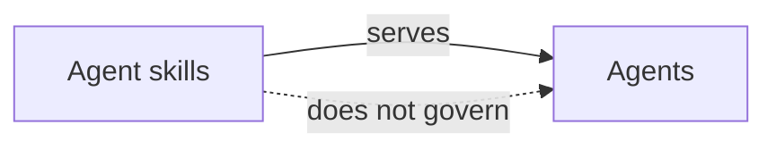

# Governance Relationships

## Hierarchical Governance

**Governance flows downward**:

The vision inspires the principles but does not govern them, and workflows orchestrate agents without governing
them.

**Agent skills (Infrastructure)**:

Agents use agent skills through inline knowledge or fork delegation.

## Cross-Layer Relationships

**Layer 1 → Layer 2 & Layer 3**:

- Principles govern BOTH conventions and development
- Both layers must trace back to principles

**Layer 2 ↔ Layer 3**:

- Conventions govern development practices
- Development practices implement conventions
- Bidirectional relationship (development respects conventions)

**Layer 3 → Layer 4**:

- Development practices govern agent implementation
- Agents must follow development conventions

**Layer 5 → Layer 4**:

- Workflows compose agents, procedures, and/or other workflows (composition, not governance)
- Workflows don't create new rules for agents

**Agent skills ↔ Agents**:

- agent skills serve agents (service relationship)
- agent skills deliver knowledge (inline mode) or delegate tasks (fork mode)
- agent skills don't govern agents

## Traceability Requirements

**Layer 0 (Vision)**:

- No required traceability (foundational)

**Layer 1 (Principles)**:

- MUST include "Vision Supported" section

**Layer 2 (Conventions)**:

- MUST include "Principles Implemented/Respected" section

**Layer 3 (Development)**:

- MUST include "Principles Implemented/Respected" section
- MUST include "Conventions Implemented/Respected" section

**Layer 4 (Agents)**:

- Frontmatter SHOULD reference relevant skills
- Description SHOULD mention enforced conventions/practices

**Layer 5 (Workflows)**:

- SHOULD document which steps are composed (agents, procedures, and/or nested workflows)
- SHOULD reference development patterns implemented

**Agent skills (Infrastructure)**:

- MAY reference conventions/development practices
- MAY reference related skills
- Optional (service infrastructure, not governance)
