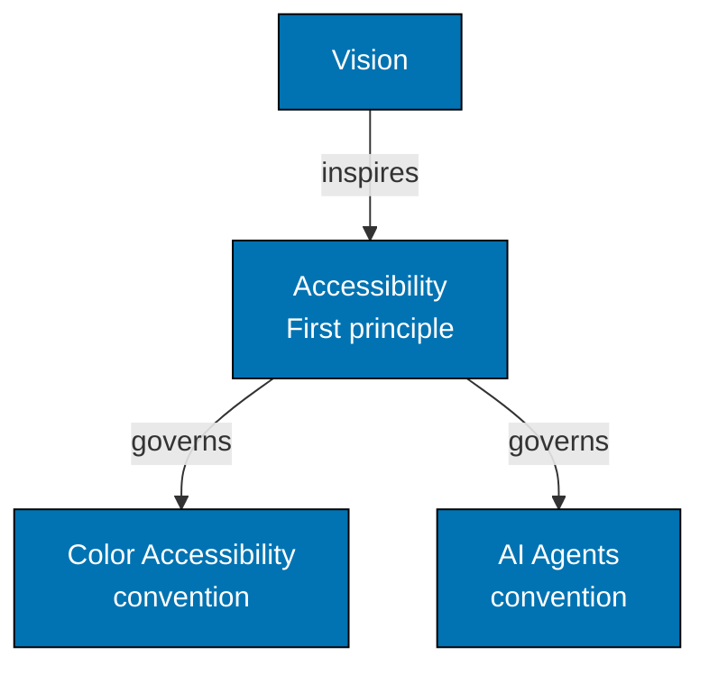

# Layer 1: Principles (WHY - Values)

**Purpose**: Foundational values that govern all conventions and development practices. Explains WHY we value certain approaches.

**Location**: `repo-governance/principles/`

**Key Document**: [Core Principles Index](../principles/README.md)

**Principles**:

**General Principles:**

- **Deliberate Problem-Solving** - Think before coding, surface assumptions, ask questions rather than guessing
- **Simplicity Over Complexity** - Minimum viable abstraction, avoid over-engineering
- **Root Cause Orientation** - Fix root causes, not symptoms; minimal impact; senior engineer standard

**Content Principles:**

- **Accessibility First** - WCAG compliance, universal design from the start
- **Documentation First** - Documentation is mandatory, not optional
- **No Time Estimates** - Outcomes over duration, respect different paces
- **Progressive Disclosure** - Layer complexity gradually

**Software Engineering Principles:**

- **Automation Over Manual** - Git hooks, AI agents for consistency
- **Explicit Over Implicit** - Transparent configuration, no magic
- **Immutability Over Mutability** - Prefer immutable data structures
- **Pure Functions Over Side Effects** - Deterministic, composable functions
- **Reproducibility First** - Eliminate "works on my machine" problems

**Characteristics**:

- Stable values that rarely change
- Each principle must include "Vision Supported" section
- Answers: "Why do we value this approach?"
- Governs both conventions (documentation) and development (software)

**Example Traceability**:

The vision is to be accessible to everyone. The AI Agents Convention applies the principle by requiring agent
colors from the accessible palette.

**Requirements**:

- Each principle MUST include "Vision Supported" section linking to Layer 0
- Principles govern Layer 2 (Conventions) and Layer 3 (Development)
- Changes require careful consideration of downstream impact
