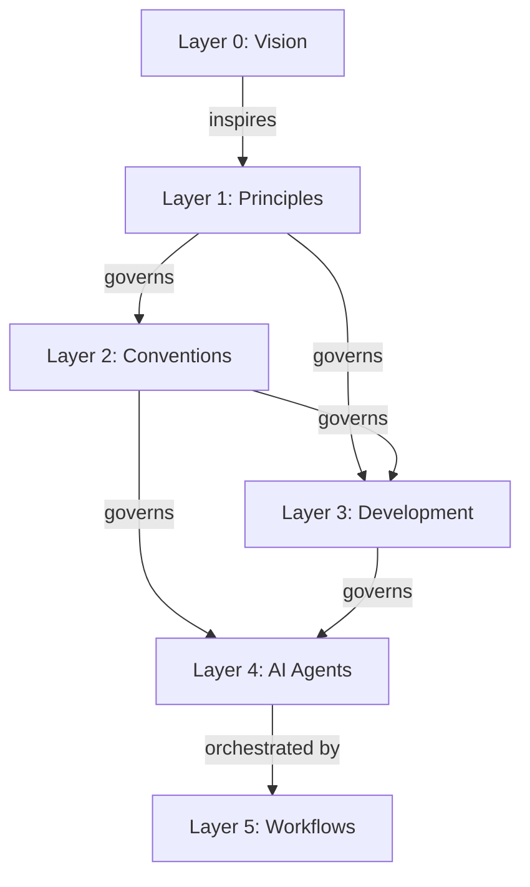

# The Six Layers

Each layer answers one question. Vision is why we exist, principles are the values behind it, conventions are what
the documentation rules are, development is how we practice, AI agents are who executes atomic tasks, and
workflows are when multi-step processes run.

**Agent skills Infrastructure** (Delivery):

- Inline skills (default): Progressive knowledge injection
- Fork skills (context: fork): Task delegation to isolated agents
- Service relationship: agent skills serve agents, don't govern them

## Quick Reference Table

| Layer | Location                     | Purpose                                                     | Changes?        | Answers?                  |
| ----- | ---------------------------- | ----------------------------------------------------------- | --------------- | ------------------------- |
| **0** | repo-governance/vision/      | WHY we exist                                                | Extremely rare  | Why does project exist?   |
| **1** | repo-governance/principles/  | WHY we value approaches                                     | Rarely          | Why value this approach?  |
| **2** | repo-governance/conventions/ | WHAT documentation rules                                    | Occasionally    | What documentation rules? |
| **3** | repo-governance/development/ | HOW we develop software                                     | More frequently | How develop software?     |
| **4** | `.claude/agents/`            | WHO enforces rules                                          | Often           | Who enforces rules?       |
| **5** | repo-governance/workflows/   | WHEN orchestrate agents, procedures, and/or other workflows | As needed       | When run which steps?     |

**Agent skills**: `.agents/skills/` - Delivery infrastructure serving agents (inline knowledge injection or fork-based delegation)
