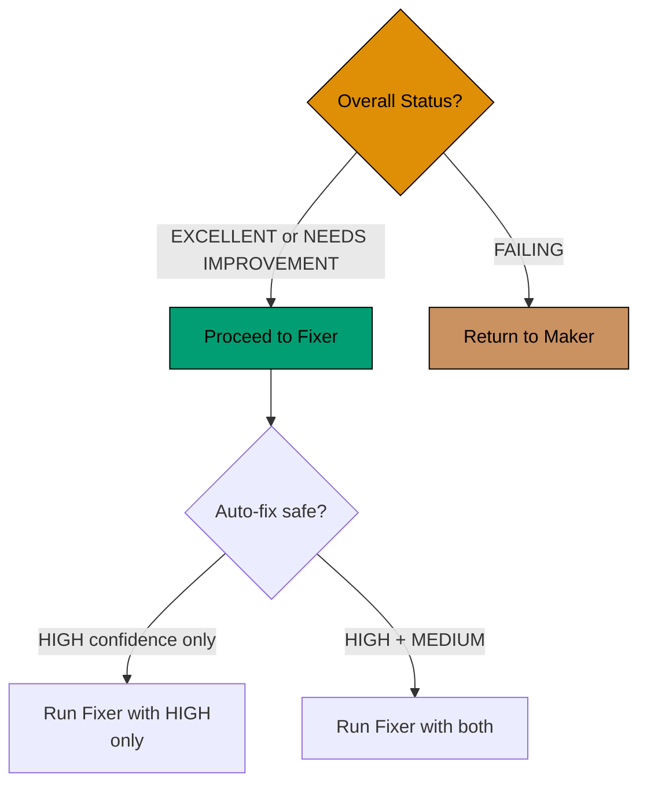

# 3. User Review (Manual Decision Point)

**Objective**: Human decision on validation findings

**User actions**:

**1. Read audit report** from local-tmp/ayokoding-web-annotated-concept/

**2. Count findings based on mode level** (default: `{input.mode}` or `normal`):

**Strictness-based counting**:

- **lax**: Count CRITICAL only
- **normal**: Count CRITICAL + HIGH
- **strict**: Count CRITICAL + HIGH + MEDIUM
- **ocd**: Count all levels (CRITICAL, HIGH, MEDIUM, LOW)

**Below-threshold findings**: Reported but don't block success

**3. Assess overall status**:

- PASS: **EXCELLENT**: Zero threshold-level findings, proceed to fixer for below-threshold issues
  (optional)
- **NEEDS IMPROVEMENT**: Some threshold-level findings, proceed to fixer for mechanical fixes
- FAIL: **FAILING**: Major structural issues (e.g., wrong mode entirely, count far below floor),
  return to maker for rework

**4. Review confidence levels**:

- **HIGH confidence**: Trust findings, approve auto-fix
- **MEDIUM confidence**: Review specific worked examples/scenarios, approve if valid
- **FALSE POSITIVE risk**: Decide whether to keep current design or fix

**5. Make decision**:

**Decision matrix**:

| Status            | HIGH Conf Issues | MEDIUM Conf Issues | Action                                 |
| ----------------- | ---------------- | ------------------ | -------------------------------------- |
| EXCELLENT         | 0-5              | 0-10               | Run fixer (all)                        |
| NEEDS IMPROVEMENT | 5-15             | 10-30              | Run fixer (HIGH only or review MEDIUM) |
| FAILING           | 15+              | 30+ or Major gaps  | Return to maker                        |

**Depends on**: Step 2 completion

**Next step**:

- If approved → Proceed to step 4
- If failing → Return to step 1
