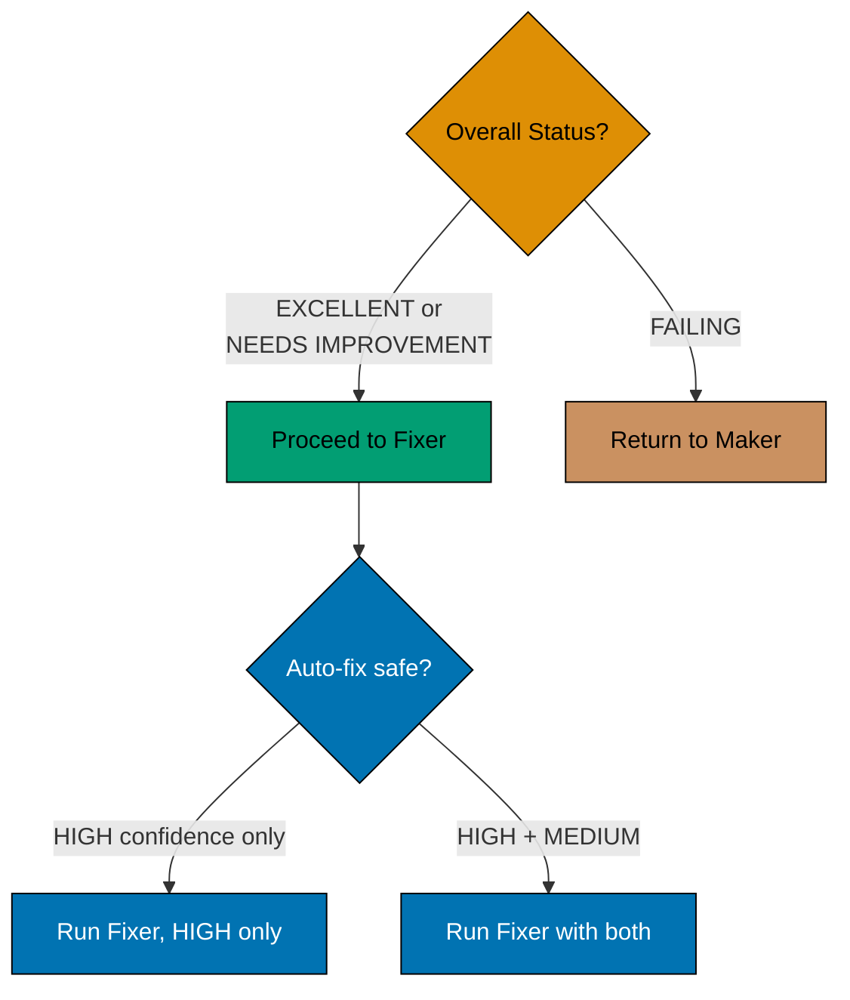
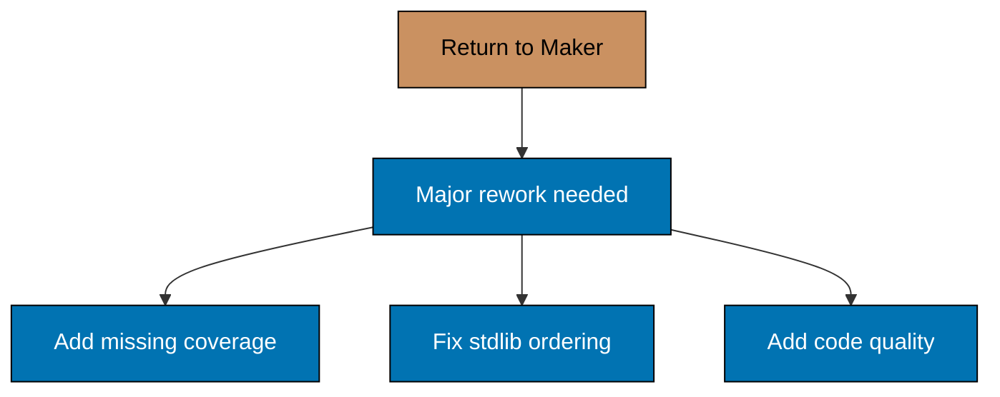

# 3. User Review (Manual Decision Point)

**Objective**: Human decision on validation findings

**User actions**:

**1. Read audit report** from local-tmp/ayokoding-web-in-the-field/

**2. Count findings based on mode level** (default: `{input.mode}` or `normal`):

**Strictness-based counting**:

- **lax**: Count CRITICAL only
- **normal**: Count CRITICAL + HIGH
- **strict**: Count CRITICAL + HIGH + MEDIUM
- **ocd**: Count all levels (CRITICAL, HIGH, MEDIUM, LOW)

**3. Assess overall status**:

- PASS: **EXCELLENT**: Zero threshold-level findings
- **NEEDS IMPROVEMENT**: Some threshold-level findings, proceed to fixer
- FAIL: **FAILING**: Major structural issues, return to maker

**4. Review confidence levels**:

- **HIGH confidence**: Trust findings, approve auto-fix
- **MEDIUM confidence**: Review specific guides, approve if valid
- **FALSE POSITIVE risk**: Decide whether to keep current design or fix

**5. Make decision**:

When the status is FAILING, the return-to-maker rework path is:

**Depends on**: Step 2 completion

**Next step**:

- If approved → Proceed to step 4
- If failing → Return to step 1
