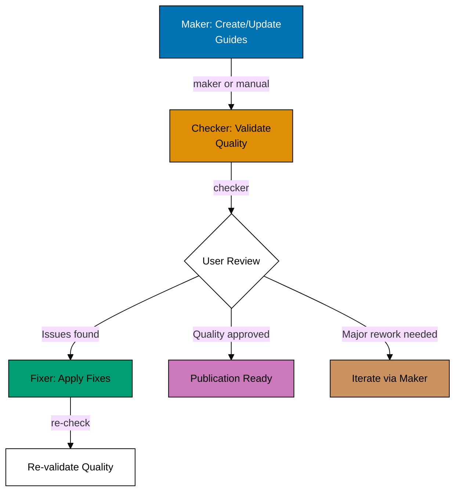

# Execution Mode, Workflow Overview, and Research Delegation

## Execution Mode

**Preferred Mode**: Agent Delegation — invoke `apps-ayokoding-www-in-the-field-checker` and
`apps-ayokoding-www-in-the-field-fixer` via the Agent tool with `subagent_type`
(see [Workflow Execution Modes Convention](../../meta/execution-modes.md)).

**Fallback Mode**: Manual Orchestration — execute workflow logic directly using
Read/Write/Edit tools when Agent Delegation is unavailable.

The Agent tool runs delegated agents that persist file changes to the actual filesystem, making it
the preferred approach when these agents exist as defined delegated agent types. Note: this workflow
includes a manual user review step (step 3) — agent delegation applies to the checker and
fixer steps, not the human decision point.

**How to Execute**:

```
User: "Run ayokoding-web in-the-field quality gate workflow for java/in-the-field/"
```

The AI will:

1. Invoke `apps-ayokoding-www-in-the-field-checker` via the Agent tool (validates guides, writes audit)
2. User reviews audit report and decides on fixes (manual decision point)
3. Invoke `apps-ayokoding-www-in-the-field-fixer` via the Agent tool (reads audit, applies fixes, writes fix report)
4. Iterate until EXCELLENT status achieved (zero findings, 20-40 guides, production quality)
5. Show git status with modified files
6. Wait for user commit approval

**Fallback (Manual Mode)**:

```
User: "Run ayokoding-web in-the-field quality gate workflow for java/in-the-field/ in manual mode"
```

The AI executes checker and fixer logic directly using Read/Write/Edit tools in the main
context — use this when agent delegation is unavailable.

## Workflow Overview



## Research Delegation

The `apps-ayokoding-www-in-the-field-maker` and `apps-ayokoding-www-facts-checker` agents invoked
by this workflow delegate multi-page web research to the
[`web-researcher`](../../../../.agents/agents/web-researcher.md) delegated agent when composing or
verifying claims about library versions, API signatures, or production best practices requires
more than one or two searches, or more than two fetches. In-context `WebSearch`/`WebFetch` remain
available for single-shot verification against known authoritative URLs. This keeps each agent's
context lean. The delegation is encoded in each agent's prompt — no workflow-level configuration
required.
