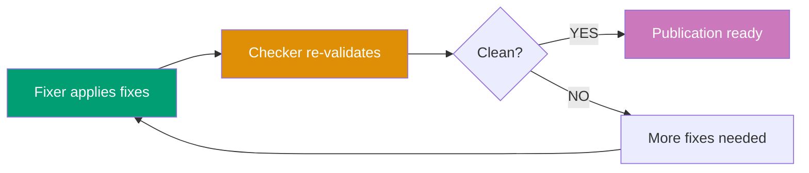

# Steps 5-6: Iteration Control and Finalization

## 5. Iteration Control (Sequential)

Determine whether to continue fixing or finalize.

**Logic**:

- Re-run checker (step 2) with Step 0 delegated IDs and Step 4's updated lifecycle evidence
- Count findings based on mode level (same as Step 3):
  - **lax**: Count CRITICAL only
  - **normal**: Count CRITICAL + HIGH
  - **strict**: Count CRITICAL + HIGH + MEDIUM
  - **ocd**: Count all levels (CRITICAL, HIGH, MEDIUM, LOW)
- Track `consecutive_zero_count` across iterations (resets to 0 when threshold-level findings > 0, increments when = 0)
- If consecutive_zero_count >= 2 AND iterations >= min-iterations (or min not provided): Proceed to step 6 (Finalization — double-zero confirmed)
- If consecutive_zero_count >= 2 AND iterations < min-iterations: Re-run checker and re-evaluate (need more iterations)
- If consecutive_zero_count < 2 AND threshold-level findings = 0: Re-run checker and re-evaluate
  (confirmation check — no fix or user review needed, just re-verify within this step)
- If threshold-level findings > 0 AND max-iterations provided AND iterations >= max-iterations: Proceed to step 6 with status `needs-improvement`
- If threshold-level findings > 0 AND (max-iterations not provided OR iterations < max-iterations): Loop back to step 3

**Below-threshold findings**: Continue to be reported in audit but don't affect iteration logic

**Depends on**: Step 4 completion

**Notes**:

- **Default behaviour**: Runs up to 7 iterations (default max-iterations). Override with higher value for more attempts
- **Consecutive pass requirement**: Zero findings must be confirmed by a second independent check before declaring success
- **Optional min-iterations**: Prevents premature termination before sufficient iterations
- Each iteration gets fresh validation report
- Tracks iteration count and finding trends
- Below-threshold findings remain visible but don't block convergence

**Iteration diagram**:

## 6. Finalization (Sequential)

Report final status and summary.

**Output**: `{final-status}`, `{lifecycle-status}`, `{iterations-completed}`, `{examples-count}`,
`{coverage-percentage}`, final reports

Derive `lifecycle-status` separately from the latest lifecycle evidence (`verified`, `pending`, or
`not-applicable`). It never changes domain `final-status`.

**Status determination**:

- **Excellent** (`excellent`): Zero threshold-level findings after final validation, 75-85 examples, 95% coverage achieved (below-threshold findings may exist and are acceptable)
- **Needs Improvement** (`needs-improvement`): Threshold-level findings remain after max-iterations OR below example/coverage targets
- **Failing** (`failing`): Major structural issues prevent auto-fixing, requires maker rework

**Depends on**: Step 5 completion
