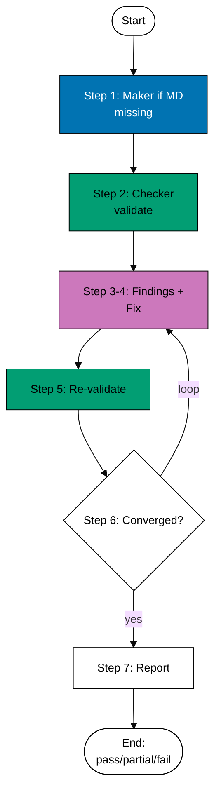

# Workflow Overview

```mermaid
%%{init: {'theme':'base', 'themeVariables': { 'fontSize':'14px'}}}%%
graph TB
    accTitle: Workflow Overview
    accDescr: [Start] leads to Step 1: Maker if MD missing; Step 1: Maker if MD missing leads to Step 2: Checker validate; Step 2: Checker validate leads to Step 3-4: Findings + Fix; and 5 more links.
    Start([Start]) --> S1[Step 1: Maker if MD<br/>missing]
    S1 --> S2[Step 2: Checker<br/>validate]
    S2 --> S34[Step 3-4: Findings +<br/>Fix]
    S34 --> S5[Step 5: Re-validate]
    S5 --> S6{Step 6: Converged?}
    S6 -->|loop| S34
    S6 -->|yes| S7[Step 7: Report]
    S7 --> End([End:<br/>pass/partial/fail])

    classDef blue fill:#0173B2,stroke:#000000,color:#FFFFFF
    classDef teal fill:#029E73,stroke:#000000,color:#000000
    classDef purple fill:#CC78BC,stroke:#000000,color:#000000
    class S1 blue
    class S2,S5 teal
    class S34 purple
    classDef default fill:#FFFFFF,stroke:#000000,color:#000000
```
