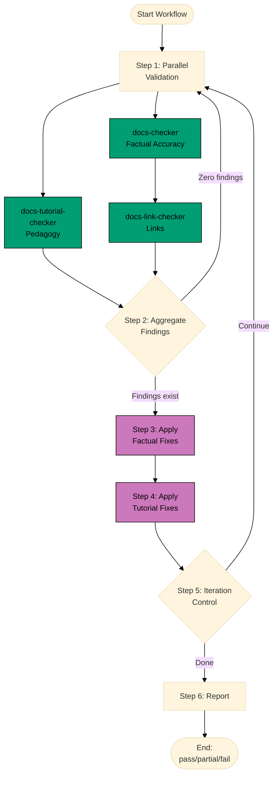

# Workflow Overview

```mermaid
%%{init: {'theme':'base', 'themeVariables': { 'fontSize':'14px'}}}%%
graph TB
    accTitle: Workflow Overview
    accDescr: [Start Workflow] leads to Step 1: Parallel Validation; Step 1: Parallel Validation leads to docs-checker Factual Accuracy; Step 1: Parallel Validation leads to docs-tutorial- checker Pedagogy; docs-checker Factual Accuracy leads to docs-link-checker Links; and 9 more links.
    Start([Start Workflow]) --> Step1[Step 1: Parallel<br/>Validation]

    Step1 --> Check1[docs-checker<br/>Factual Accuracy]
    Step1 --> Check2[docs-tutorial-<br/>checker<br/>Pedagogy]
    Check1 --> Check3[docs-link-checker<br/>Links]

    Check2 --> Step2{Step 2: Aggregate<br/>Findings}
    Check3 --> Step2

    Step2 -->|Zero findings| Step1
    Step2 -->|Findings exist| Step3[Step 3: Apply<br/>Factual Fixes]

    Step3 --> Step4[Step 4: Apply<br/>Tutorial Fixes]
    Step4 --> Step5{Step 5: Iteration<br/>Control}

    Step5 -->|Continue| Step1
    Step5 -->|Done| Step6[Step 6: Report]

    Step6 --> End([End:<br/>pass/partial/fail])

    classDef teal fill:#029E73,stroke:#000000,color:#000000
    classDef purple fill:#CC78BC,stroke:#000000,color:#000000
    class Check1,Check2,Check3 teal
    class Step3,Step4 purple
```
