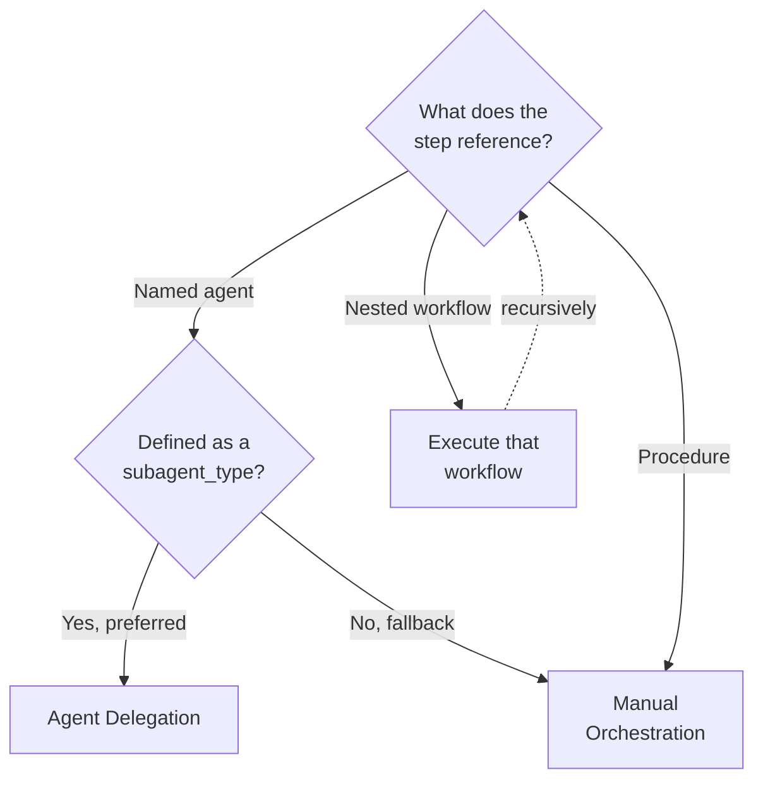

# Workflow Execution Mode Convention

This convention defines the execution modes for workflows in this repository: **Agent
Delegation** (preferred, invoke agents via the Agent tool so file changes persist) and **Manual
Orchestration** (fallback, execute workflow logic directly with Read/Write/Edit/Bash tools).
Covers the decision flow, the manual step-by-step pattern, an authoring template, and common
pitfalls below.

## Contents

- [The Core Challenge](./execution-modes/the-core-challenge.md) — why persistence needs a defined mode.
- [Agent Delegation Mode (Preferred)](./execution-modes/agent-delegation-mode.md) — invoking agents via the Agent tool.
- [Manual Orchestration Mode (Fallback)](./execution-modes/manual-orchestration-mode.md) — direct tool execution.
- [Manual Mode Execution Pattern](./execution-modes/manual-mode-execution-pattern.md) — the six-step manual procedure.
- [Implementation Example](./execution-modes/implementation-example.md) — the Execution Mode section template.
- [Future Considerations](./execution-modes/future-considerations.md) — potential workflow-runner automation.
- [Tool Usage Rules](./execution-modes/tool-usage-rules.md) — which tools apply per mode.
- [Common Pitfalls](./execution-modes/common-pitfalls.md) — four recurring mistakes and fixes.

## Overview

This convention defines the execution modes for workflows in this repository: **Agent Delegation** (preferred) and **Manual Orchestration** (fallback). Understanding both modes is essential for executing workflows that require persistent file changes.

## Principles Implemented/Respected

- **Explicit Over Implicit**: Clear description of execution mode behaviour
- **Simplicity Over Complexity**: Two clearly defined modes with explicit decision flow
- **Documentation First**: Document current reality, not ideal future state
- **No Time Estimates**: Focus on what to do, not how long it takes
- **Automation Over Manual**: Agent Delegation preferred over manual execution

## Related Documentation

- [Workflow Pattern Convention](./workflow-identifier.md) - Overall workflow structure
- [Plan Quality Gate Workflow](../plan/plan-quality-gate.md) - Example workflow using agent delegation
- [AI Agents Convention](../../development/agents/ai-agents.md) - Agent invocation patterns
- [Maker-Checker-Fixer Pattern](../../development/pattern/maker-checker-fixer.md) - Validation workflow pattern

## Execution Mode Decision Flow

A named agent is defined when `.agents/agents/` holds it and its generated route makes it a `subagent_type`. A nested workflow applies this
decision flow recursively, and a procedure's steps are followed directly.
