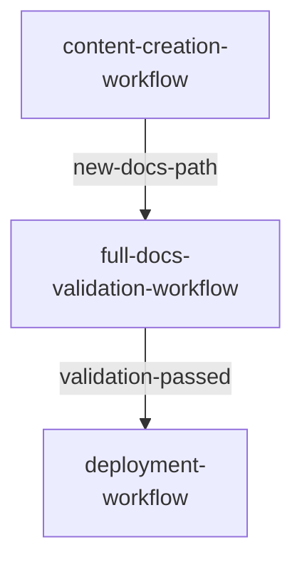

# Composability

Workflows are first-class composable units. A workflow step can be another workflow, an agent, or a procedure — in any combination and order, with looping.

```markdown
### 2. Run Validation Workflow (Nested)

**Workflow**: `docs/docs-quality-gate`

- **Args**: `scope: {input.scope}`
- **Output**: `{validation-status}`

This step executes another workflow.
```

Mixed composition example — agents, procedures, and nested workflows in one workflow:

```markdown
### 1. Prepare Environment (Procedure)

Run `rtk ./hippo run --class ephemeral --disk-path . -- npm install`, then
`rtk npm run doctor -- --fix`.

### 2. Validate Docs (Nested Workflow)

**Workflow**: `docs/docs-quality-gate`

- **Args**: `scope: all, mode: strict`
- **Output**: `{docs-status}`

### 3. Validate CI (Nested Workflow)

**Workflow**: `ci/ci-quality-gate`

- **Args**: `scope: all`
- **Output**: `{ci-status}`

### 4. Report Summary (Agent)

**Agent**: `docs-maker`

- **Args**: `docs-status: {step2.outputs.docs-status}, ci-status: {step3.outputs.ci-status}`
```

Output from one workflow becomes input to another:



Each arrow carries the upstream workflow's output, and the deployment workflow consumes `validation-passed`.
