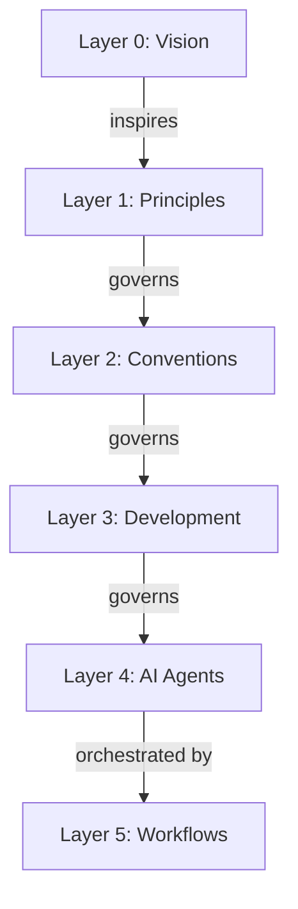

# Repository Hierarchy

Vision is why we exist, principles are the foundational values, conventions are the documentation rules,
development holds the software practices, AI agents execute atomic tasks, and workflows orchestrate multi-step
processes.

**Key relationship**: Workflows are to Agents what Agents are to Tools - a composition layer.
