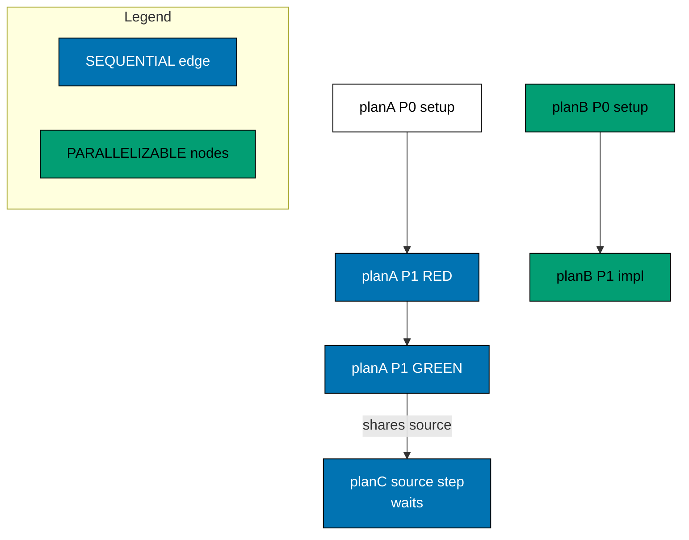

# Phase A — Load Plans and Build the Dependency DAG (Edges, Report, and Diagram)

Continued from
[Phase A — Scope and Nodes](./phase-a-scope-and-nodes.md).

**A4. Add intra-plan edges (ordering within a plan).** Within a single plan, nodes are ordered by:
(a) the declared work-location / setup step first; (b) TDD ordering — `RED` → `GREEN` → `REFACTOR`
sub-steps are strictly sequential; (c) phase gates — a phase's gate node depends on all nodes in that
phase, and the next phase depends on the gate; (d) the archival node last. The default is
**sequential within a plan** unless the plan's own text explicitly marks two phases/steps as
independent. This preserves every per-plan Iron Rule (TDD, one-`in_progress`-per-plan, atomic sync).

**A5. Compute each node's resource-set (conservative).** From named paths and the plan's File-Impact
Analysis, derive file/glob, Nx-project, target-repo, and work-location resources. Every `main-to-*`
node takes the shared `primary-checkout:<repo>` lock; each `worktree-to-*` plan takes its own lock.
Add a shared-source flag only when a plan explicitly declares a still-local byte-identity boundary.
An ambiguous footprint touches the whole declared impact set: uncertain nodes conflict.

**A6. Add inter-plan edges (Hybrid ordering).**

1. **Explicit `Depends-on:` wins.** If a plan's `README.md` declares `Depends-on: [<plan-id>, …]`,
   that whole plan is serialized after every named dependency (all of the dependency's nodes precede
   any of this plan's nodes). Explicit declarations are authoritative and never overridden by
   inference.
2. **Inference fills the gaps.** For any pair of plans with no explicit relationship, infer edges
   from **resource overlap**: two nodes whose resource-sets intersect (same file/glob, same Nx
   project, or an explicitly declared shared-source flag) **conflict** and must not run concurrently
   — the scheduler serializes them (the later-scheduled one waits). Nodes with disjoint
   resource-sets are **parallelizable**.
3. **Cycle check.** If explicit `Depends-on` declarations form a cycle, stop and report — a cyclic
   plan graph is a planning error, not something to schedule around.

**A7. Emit the DAG / parallelizability report** to
`local-tmp/multi-plans-execution/multi-plans-execution__<uuid>__<timestamp>__dag.md`: the node list per plan, the
intra- and inter-plan edges, each node's resource-set, and — explicitly — which nodes are marked
**PARALLELIZABLE** vs **SEQUENTIAL** and why. If `mode: plan-only`, STOP here and hand the report to
the caller for review.

> **Pause Safety**: safe to stop after Phase A. Nothing has been executed; only the schedule exists.
