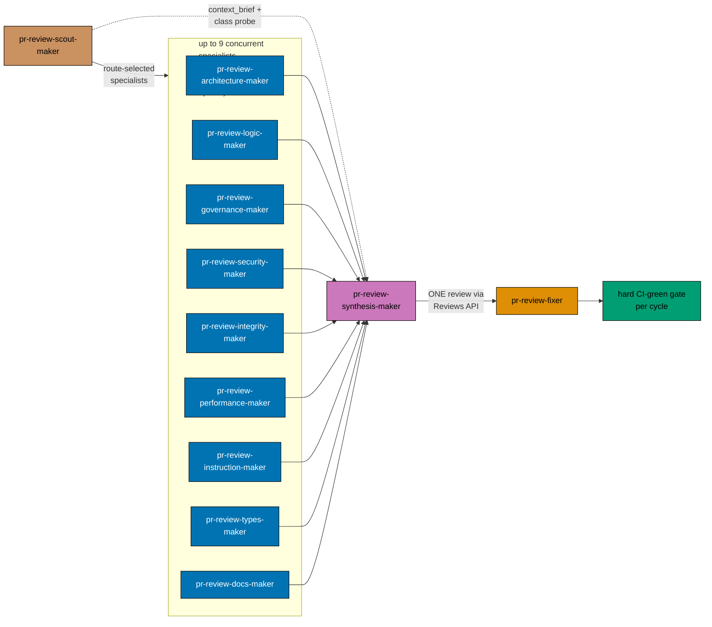

# Pipeline Diagrams

## Participants Flowchart



## Loop Sequence Diagram (One Cycle)

```mermaid
sequenceDiagram
  accTitle: Loop Sequence Diagram (One Cycle)
  accDescr: O sends rehydrate cycle history and ceiling state to GH; GH sends reviews, dispositions, probes, checkpoints, threads to O; O sends cycle number N of {total} to SC; and 14 more links.
  participant O as Orchestrator (this workflow)
  participant SC as pr-review-scout-<br/>maker
  participant SP as up to 9 specialist-makers<br/>(DD-10 may skip up to 2)
  participant SY as pr-review-synthesis-maker
  participant GH as GitHub PR Reviews API
  participant F as pr-review-fixer
  participant CI as CI on PR

  O->>GH: rehydrate cycle history and ceiling state
  GH-->>O: reviews, dispositions, probes, checkpoints, threads
  O->>SC: cycle number N of {total}
  SC->>SC: pin head, select route/set, build context, choose probe class and prior-use state
  SC->>SP: fan out specialists (context brief + probe fields)
  SC->>SY: hand context brief + probe class/prior-use directly
  SP-->>SY: raw findings per discipline
  SY->>SY: dedup + re-categorize + reasonableness-filter + tool-verify
  SY->>GH: require live head equals scout pin
  SY->>GH: post ONE consolidated review (line-anchored)
  GH->>F: unresolved review threads
  F->>GH: require live head equals scout pin
  F->>F: 4-way triage per comment
  F->>GH: push fixes, reply, resolve
  F->>CI: trigger checks
  CI-->>O: GREEN for exact expected head
  O->>GH: require live expected head; clean only if still scout pin
```
