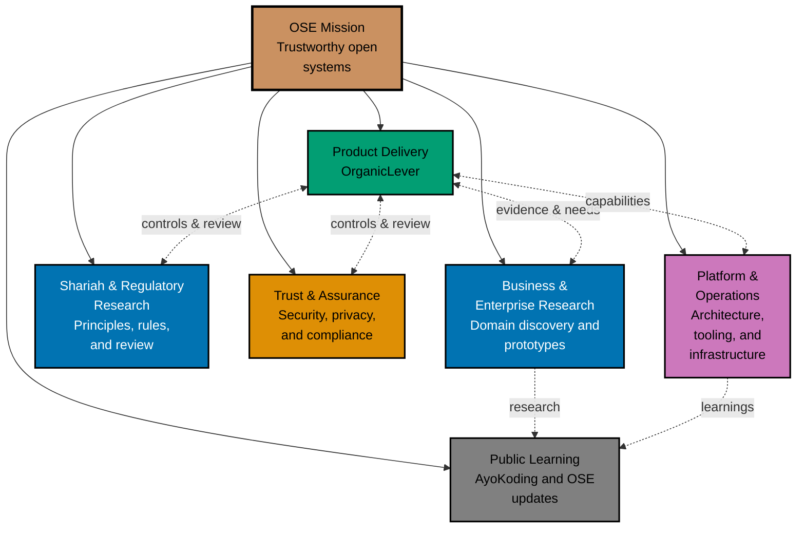

# 🗺️ Development Roadmap

Open Sharia Enterprise develops products, platform capabilities, and research through
**concurrent workstreams**. The roadmap does not impose a fixed portfolio-wide sequence or require
one product area to finish before another can begin.

Product delivery, Shariah and regulatory research, business and enterprise research, trust and
assurance, platform engineering, and public education progress alongside one another when evidence,
dependencies, and capacity allow.

## 🔀 Operating Model

- **Workstreams progress independently** — each workstream owns its goals, evidence, and
  deliverables.
- **Priority does not imply sequence** — focusing delivery capacity on one workstream does not block
  research or validation in another.
- **Dependencies stay explicit** — a deliverable waits only for prerequisites that it actually
  needs, not for a portfolio-wide stage transition.
- **Learning flows across the portfolio** — discoveries from one workstream inform the others
  without becoming universal gates.
- **Production requires readiness** — parallel exploration does not bypass product, Shariah,
  security, operational, or quality checks.

The diagram shows coordination and evidence exchange, not a start-to-finish sequence.

## 🚀 Product Delivery

### OrganicLever

**Purpose**: Deliver and validate a local-first individual productivity product while testing
full-stack development and operational practices in a real application.

**Current repository surfaces**:

- 🌐 [`organiclever-www`](./apps/organiclever-www/) — public marketing website at
  [organiclever.com](https://www.organiclever.com/)
- 💻 [`organiclever-app-web`](./apps/organiclever-app-web/) — Next.js 16 local-first product client
- 🔧 [`organiclever-be`](./apps/organiclever-be/) — F#/Giraffe/ASP.NET REST API
- 🧪 [`organiclever-app-web-e2e`](./apps/organiclever-app-web-e2e/) and
  [`organiclever-be-e2e`](./apps/organiclever-be-e2e/) — paired end-to-end suites

**Product direction**:

- Productivity tracking, journaling, routines, workouts, and personal insights
- Local-first data ownership with open, portable formats
- Shariah-aware features introduced only with appropriate research and review
- Proportional security, privacy, observability, and deployment controls

OrganicLever is a product-delivery workstream and a learning environment. It can progress in
parallel with the other workstreams.

### Business and Enterprise Product Initiatives

Small and medium business systems and enterprise systems remain important product directions. They
can progress in parallel with OrganicLever and are not designated as mandatory successors.

Work can begin as focused research, domain modelling, contract design, or prototypes whenever a
clear question and sufficient capacity exist. A product commitment requires evidence of a real user
need, defined scope, viable funding, and relevant readiness checks.

## 🔬 Business and Enterprise Research

This workstream investigates the domains and capabilities needed by Shariah-compliant organizations
without committing prematurely to a specific product or architecture.

Typical outputs include:

- Business workflow and user research
- Domain-Driven Design artefacts and bounded-context experiments
- Open contracts and interoperability standards
- Knowledge-management and enterprise resource planning concepts
- Multi-user, multi-organization, and multi-jurisdiction requirements
- Architecture prototypes justified by observed scale or reliability needs

Research may run in parallel with OrganicLever delivery. Findings become dependencies only when a
specific deliverable relies on them.

## 🕌 Shariah and Regulatory Research

This workstream develops the knowledge and review practices required to make trustworthy
Shariah-compliance claims.

Typical outputs include:

- Traceable Shariah principles and business rules
- Jurisdiction-specific regulatory research
- Scholar-review and evidence requirements
- Auditable calculation and decision models
- Guidance for avoiding unsupported compliance claims

Research starts before product implementation where risk warrants it and continues throughout a
deliverable's life.

## 🛡️ Trust and Assurance

Security, privacy, compliance, and governance progress continuously rather than waiting for a later
portfolio stage.

Typical outputs include:

- Threat modelling and secure development practices
- Privacy and data-ownership controls
- Software supply-chain and dependency safeguards
- Auditability, evidence capture, and quality gates
- Certification research driven by actual product and jurisdiction needs

Certification cost and funding affect prioritization, but they do not impose a universal product
sequence.

## 🏗️ Platform and Operations

This workstream evolves the shared technical foundation as concrete product and research needs
emerge.

Current areas include:

- Nx monorepo tooling, reproducible environments, and CI/CD
- Next.js and TypeScript web applications
- F#/Giraffe backends and PostgreSQL
- Rust and F# command-line tooling
- Shared UI, Rust, and F# libraries
- Deployment, Kubernetes, observability, and reliability research
- AI-assisted planning, development, review, and repository governance

Technology choices belong to the initiative that needs them. The roadmap does not reserve
languages or architectures for future portfolio stages.

## 📚 Public Learning

Open Sharia Enterprise shares research and engineering lessons while the other workstreams
progress:

- [AyoKoding](https://ayokoding.com) publishes educational material.
- [OSE Platform](https://oseplatform.com) communicates project direction and updates.
- Repository documentation, specifications, and governance preserve reusable knowledge.

Public learning can draw from any active workstream while respecting security, privacy, licensing,
and factual-accuracy constraints.

## ✅ Established Foundations

The following foundations already support the concurrent model and continue to evolve:

- Development tooling, reproducible environments, git hooks, and CI/CD
- Diátaxis documentation and repository-governance systems
- Specialized AI agents, skills, and quality workflows
- [ayokoding.com](https://ayokoding.com) and [oseplatform.com](https://oseplatform.com)
- Rust and F# command-line tooling
- Nx-managed applications, libraries, end-to-end suites, and Gherkin specifications

“Established” does not mean frozen or universally complete. Each foundation changes when a
workstream presents a justified need.

## 🎯 Prioritization and Readiness

Portfolio priorities consider:

- Mission impact and user value
- Strength of evidence and clarity of the next question
- Explicit dependencies
- Risk reduction and reusable learning
- Available capacity and funding
- Opportunity to produce a coherent, independently valuable deliverable

Each initiative or deliverable can move through:

1. **Discovery** — define the problem, research constraints, and test assumptions.
2. **Validation** — demonstrate user value and technical feasibility with evidence.
3. **Production readiness** — satisfy the relevant product, Shariah, security, operational, and
   quality gates.

These readiness states belong to individual deliverables. Different deliverables can occupy
different states at the same time.

## 💭 Why This Approach?

- 🔀 **Parallel learning** — research and delivery progress wherever useful work is unblocked.
- 🎯 **Focused execution** — explicit priorities prevent parallelism from becoming uncontrolled
  multitasking.
- 🔗 **Real dependencies** — initiatives wait for necessary evidence, not arbitrary stage labels.
- 🧪 **Continuous validation** — each deliverable proves its own assumptions with real users and
  proportional testing.
- 🕌 **Compliance by design** — Shariah and regulatory research run alongside product discovery.
- 🛡️ **Assurance from the start** — security, privacy, and governance evolve continuously.
- 📈 **Progressive complexity** — each workstream starts with the simplest useful experiment and
  adds complexity only when evidence justifies it.
- 💰 **Sustainable choices** — funding influences priority and scope without dictating a fixed
  product order.
