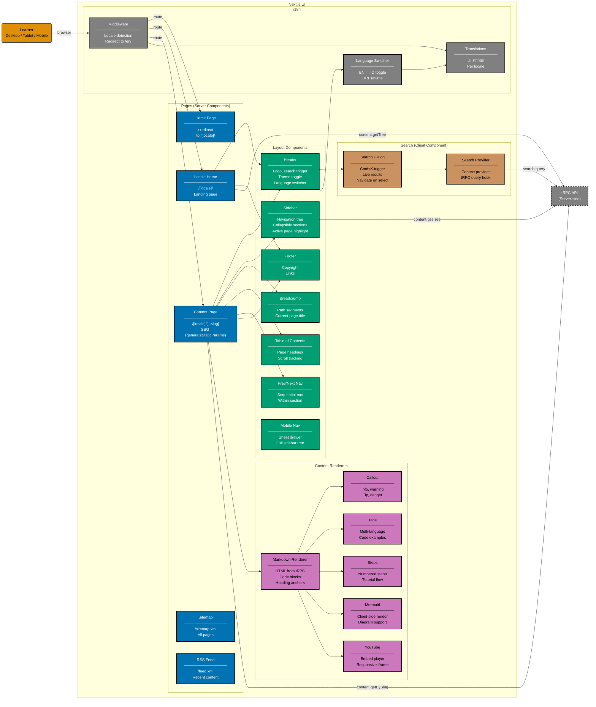

# Component Diagram: UI (Frontend)

Level 3 of the C4 model. Shows the logical components inside the Next.js client-side application:
pages, layout components, content renderers, search, and internationalization.

Pages are Server Components by default. Client Components are used only where browser interactivity
is needed (search dialog, theme toggle, language switcher, sidebar tree, Mermaid rendering).

## Gherkin Coverage by Component

Each component above is exercised by Gherkin features from
[`specs/apps/ayokoding-web/fe/gherkin/`](../fe/) (future):

| Component                        | Expected Domain | Scope                                  |
| -------------------------------- | --------------- | -------------------------------------- |
| Content Page + Markdown Renderer | content         | Page rendering, code blocks, headings  |
| Search Dialog + Search Provider  | search          | Search trigger, results, navigation    |
| Sidebar + Breadcrumb + Prev/Next | navigation      | Tree navigation, breadcrumbs, ordering |
| Language Switcher + Middleware   | i18n            | Locale toggle, URL rewrite, redirects  |
| Header + Footer + Mobile Nav     | layout          | Responsive layout, accessibility       |

## Testing

| Level       | What                           | Coverage |
| ----------- | ------------------------------ | -------- |
| `test:unit` | Component rendering via Vitest | >= 80%   |
| `test:e2e`  | Full browser via Playwright    | N/A      |

## Related

- **Container diagram**: [container.md](./container.md)
- **Backend component diagram**: [component-be.md](./component-be.md)
- **Frontend gherkin specs**: [fe/gherkin/](../fe/)
- **Parent**: [ayokoding-web specs](../README.md)
