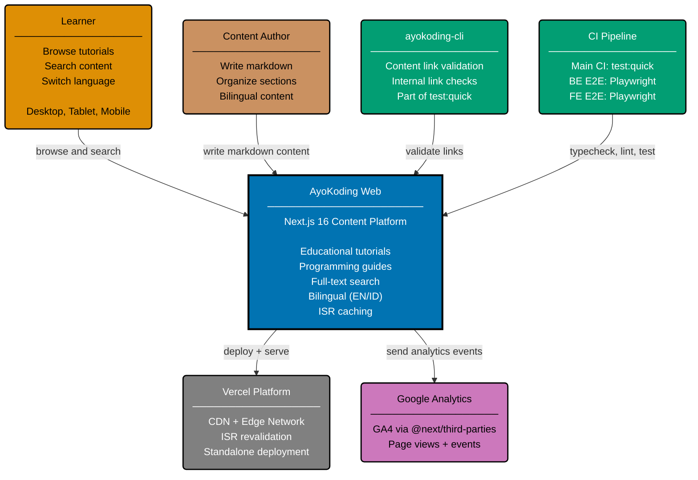

# Context Diagram: AyoKoding Web

Level 1 of the C4 model. Shows the AyoKoding Web platform as a single system with its external
actors. The system is a Next.js 16 fullstack content platform that serves bilingual educational
content (English and Indonesian) for developers.

## Actors

| Actor            | Role                                                                     |
| ---------------- | ------------------------------------------------------------------------ |
| Learner          | Browses tutorials, searches content, switches between EN/ID              |
| Content Author   | Creates markdown content with YAML frontmatter in `content/` directory   |
| ayokoding-cli    | Validates internal links in content files (runs as part of `test:quick`) |
| CI Pipeline      | Runs typecheck, lint, unit tests, BE/FE E2E tests via Playwright         |
| Vercel           | Hosts the production deployment with ISR and CDN edge caching            |
| Google Analytics | Collects page view and event data via GA4 (`@next/third-parties`)        |

## Related

- **Container diagram**: [container.md](./container.md)
- **Backend component diagram**: [component-be.md](./component-be.md)
- **Frontend component diagram**: [component-fe.md](./component-fe.md)
- **Parent**: [ayokoding-web specs](../README.md)
