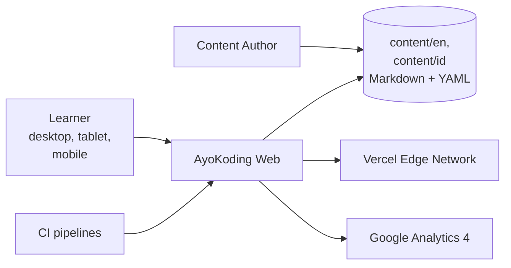

# AyoKoding Web — Architecture

The current, as-built system. A change that alters an actor, a container, a component
responsibility, a relationship, or a boundary updates this document in the same delivery unit.

## Scope

AyoKoding serves programming, AI, and security tutorials in English and Indonesian. Content is
Markdown with YAML frontmatter, checked into the repository and rendered as static pages. There is
no authentication, no comments, and no backend service beyond the tRPC API that runs inside the same
Next.js process.

## System Context

A learner never authenticates, so every page is cacheable and the site can be served statically from
the edge. A content author's only interface is a Markdown file: frontmatter governs title, ordering,
dates, tags, and draft state, which is why an authoring mistake surfaces as a build failure rather
than a runtime one.

## Containers

AyoKoding deploys **one** container. The Next.js server tier and the browser tier are two runtime
tiers of that same container, not two containers, because they ship as one Vercel deployment unit.

| Container | Technology                       | Responsibility                                          |
| --------- | -------------------------------- | ------------------------------------------------------- |
| `web`     | Next.js 16 App Router + tRPC v11 | server-rendered pages, static generation, `/api/trpc/*` |

Two stores sit inside the system boundary and neither is a database: the content directory is the
repository's own Markdown tree, and the search index is a per-locale in-memory FlexSearch index
built from it. Both are derived at build time, which is what makes the deployment stateless.

## Components

Six bounded contexts span both tiers. A context owns its rendering, its tRPC procedures, and its
scenarios together.

| Bounded context | Responsibility                                                             |
| --------------- | -------------------------------------------------------------------------- |
| `app-shell`     | header, footer, mobile navigation, responsive layout, accessibility        |
| `content`       | Markdown parsing, syntax highlighting, `content.getBySlug`, `listChildren` |
| `navigation`    | sidebar tree, breadcrumbs, prev/next ordering, `content.getTree`           |
| `search`        | search dialog, per-locale index, `search.query`                            |
| `i18n`          | locale middleware, language switcher, `meta.languages`                     |
| `health`        | `meta.health`                                                              |

## Behaviour Perspectives

`behaviours/` splits by the perspective a scenario takes, not by deployable — there is only one
deployable to split on:

- `behaviours/frontend/` asserts what a learner sees in the DOM.
- `behaviours/backend/` asserts what a tRPC procedure returns, including its error codes.
- `behaviours/build-tools/` asserts what the build-time index generators produce. These scripts run
  before the container is built and are never deployed, which is why their scenarios sit beside the
  site's rather than in a corpus of their own.

## Constraints

**Static generation is the default.** Every content route is generated at build time via
`generateStaticParams`. A feature that requires per-request rendering changes the deployment's cost
and cache behaviour, so it is an architectural decision rather than an implementation detail.

**Locale is carried in the URL.** Middleware rewrites `/` to a locale-prefixed path, and the same
slug must resolve to the equivalent page under either locale. A content file that exists in one
locale and not the other is a navigation defect, not a missing translation.

**Accessibility is a build-time obligation.** WCAG AA — skip-to-content, keyboard navigation, focus
rings, contrast — is asserted by scenarios rather than reviewed by eye.

## Related

- [Behaviours](./behaviours/README.md) — the scenarios this system must satisfy.
- [`apps/ayokoding-www/README.md`](../../../../apps/ayokoding-www/README.md) — the implementing project.
