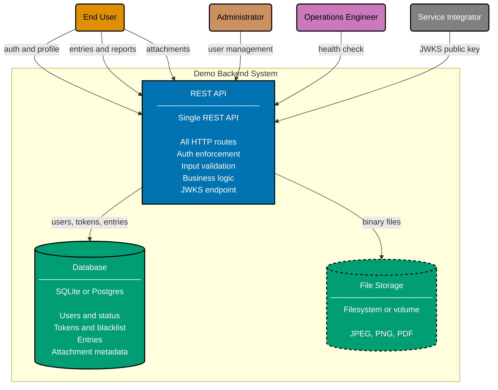

# Container Diagram: Demo Backend

Level 2 of the C4 model. Shows the three runtime containers inside the Demo Backend system
boundary and how actors interact with them.

The token blacklist is stored inside the Database — no separate cache is required at
demo scale.

