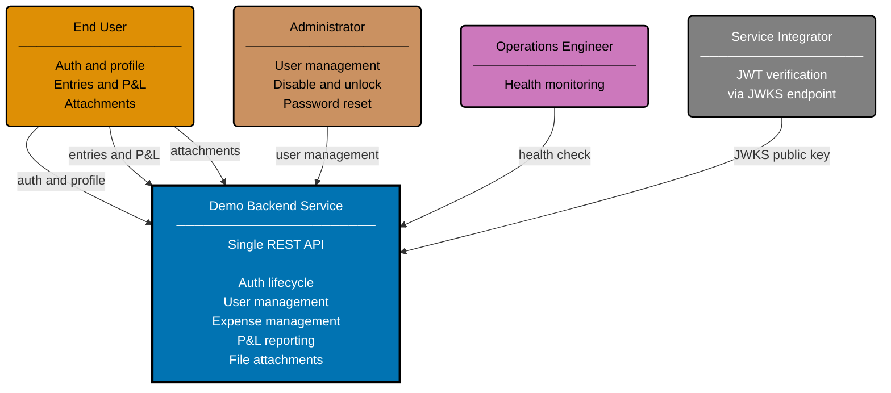

# Context Diagram: Demo Backend

Level 1 of the C4 model. Shows the Demo Backend system and the four external parties that
interact with it, without revealing any internal structure.

```mermaid
%% Color Palette: Blue #0173B2 | Orange #DE8F05 | Teal #029E73 | Purple #CC78BC | Brown #CA9161 | Gray #808080
graph TD
    EU("End User<br/>──────────────────<br/>Auth and profile<br/>Entries and P&L<br/>Attachments"):::actor

    ADM("Administrator<br/>──────────────────<br/>User management<br/>Disable and unlock<br/>Password reset"):::actor_admin

    OPS("Operations Engineer<br/>──────────────────<br/>Health monitoring"):::actor_ops

    SI("Service Integrator<br/>──────────────────<br/>JWT verification<br/>via JWKS endpoint"):::actor_si

    BACKEND["Demo Backend Service<br/>──────────────────────<br/>Single REST API<br/><br/>Auth lifecycle<br/>User management<br/>Expense management<br/>P&L reporting<br/>File attachments"]:::system

    EU -->|"auth and profile"| BACKEND
    EU -->|"entries and P&L"| BACKEND
    EU -->|"attachments"| BACKEND

    ADM -->|"user management"| BACKEND

    OPS -->|"health check"| BACKEND

    SI -->|"JWKS public key"| BACKEND

    classDef actor fill:#DE8F05,stroke:#000000,color:#000000,stroke-width:2px
    classDef actor_admin fill:#CA9161,stroke:#000000,color:#000000,stroke-width:2px
    classDef actor_ops fill:#CC78BC,stroke:#000000,color:#000000,stroke-width:2px
    classDef actor_si fill:#808080,stroke:#000000,color:#FFFFFF,stroke-width:2px
    classDef system fill:#0173B2,stroke:#000000,color:#FFFFFF,stroke-width:3px
```
