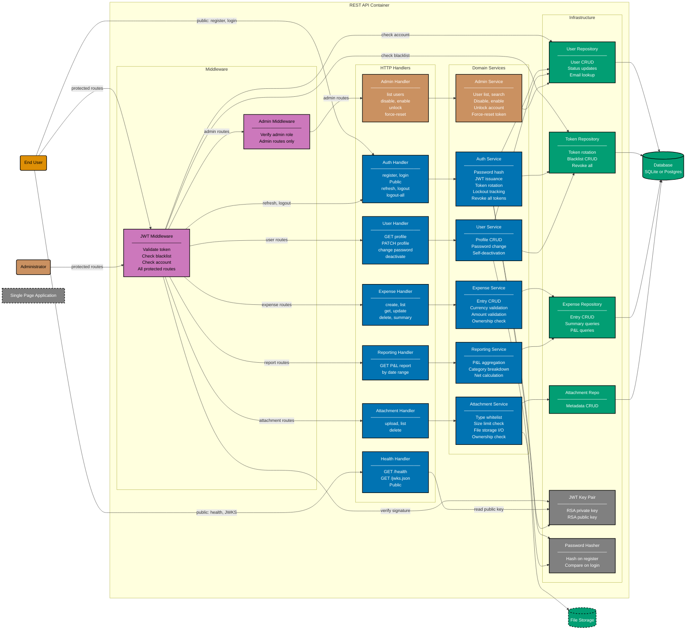

# Component Diagram: REST API

Level 3 of the C4 model. Shows the logical components inside the REST API container and how
they relate. Organised into four layers: HTTP handlers, middleware, domain services, and
infrastructure (repositories + shared utilities).

**Public routes** (register, login, health, JWKS) bypass JWT Middleware.
**Protected routes** pass through JWT Middleware before reaching their handler.
**Admin routes** additionally pass through Admin Middleware after JWT Middleware.

## Related

- **Container diagram**: [container.md](./container.md)
- **Frontend component diagram**: [component-fe.md](./component-fe.md)
- **Backend gherkin specs**: [be/gherkin/](../be/gherkin/README.md)
