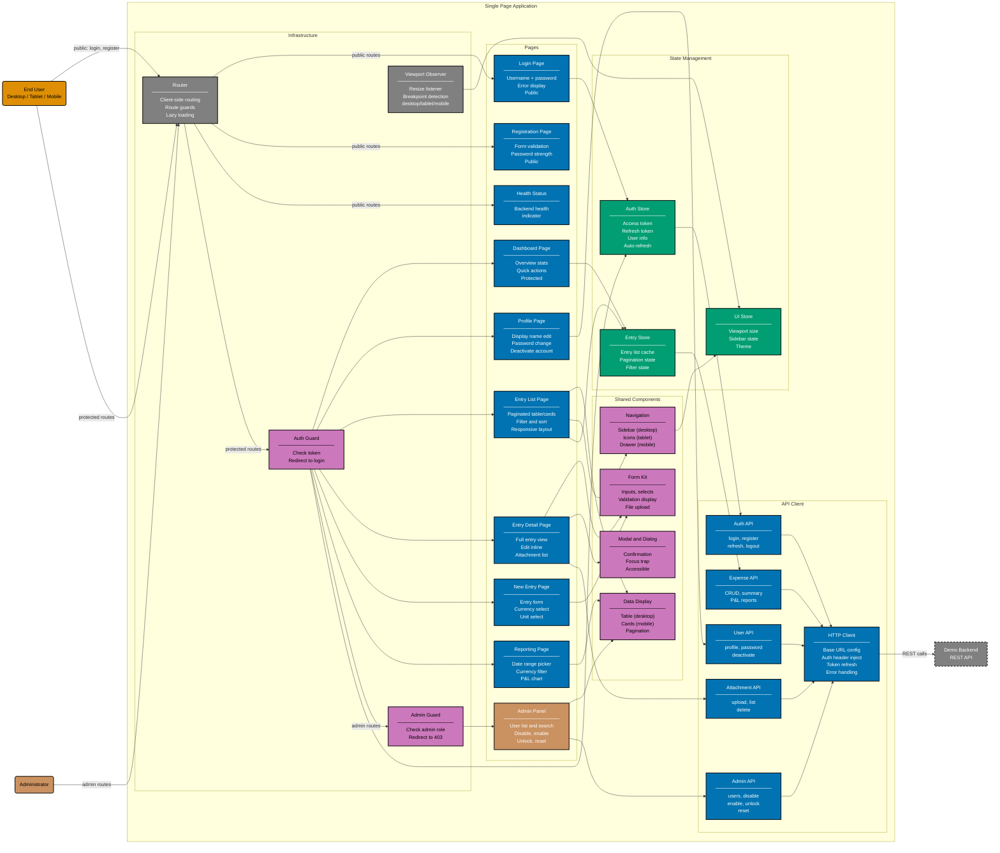

# Component Diagram: Single Page Application

Level 3 of the C4 model. Shows the logical components inside the SPA container and how they relate.
Organised into five layers: pages, shared components, state management, API client, and
infrastructure.

**Public pages** (login, registration) bypass Auth Guard.
**Protected pages** pass through Auth Guard before rendering.
**Admin pages** additionally pass through Admin Guard after Auth Guard.

## Gherkin Coverage by Component

Each component above is exercised by Gherkin features from
[`specs/apps/demo/fe/gherkin/`](../fe/gherkin/README.md) (15 features, 92 scenarios):

| Component                             | Gherkin Domain(s) | Features                                                         |
| ------------------------------------- | ----------------- | ---------------------------------------------------------------- |
| Health Status                         | health            | health-status (2)                                                |
| Login Page + Auth Store               | authentication    | login (5), session (7)                                           |
| Registration Page                     | user-lifecycle    | registration (6)                                                 |
| Profile Page                          | user-lifecycle    | user-profile (6)                                                 |
| Admin Panel                           | admin             | admin-panel (6)                                                  |
| Entry List + Entry Detail + New Entry | expenses          | expense-management (7), currency-handling (6), unit-handling (4) |
| Reporting Page                        | expenses          | reporting (6)                                                    |
| Entry Detail (attachments)            | expenses          | attachments (10)                                                 |
| Auth Store + Auth Guard               | token-management  | tokens (6)                                                       |
| Login Page (lockout)                  | security          | security (5)                                                     |
| Navigation + Data Display + all pages | layout            | responsive (10)                                                  |
| Form Kit + Modal + all pages          | layout            | accessibility (6)                                                |

## API Contract

All 3 frontend implementations generate types from the same OpenAPI 3.1 spec:

- **Source**: [`specs/apps/demo/contracts/openapi.yaml`](../contracts/openapi.yaml)
- **Codegen target**: `nx run <frontend>:codegen` (depends on `demo-contracts:bundle`)
- **Output**: `<frontend>/generated-contracts/` or `<frontend>/src/generated-contracts/`

## Testing

| Level       | What                            | Gherkin            | Coverage |
| ----------- | ------------------------------- | ------------------ | -------- |
| `test:unit` | Service-layer calls, mocked API | Yes (92 scenarios) | >= 70%   |
| `test:e2e`  | Full browser via Playwright     | Yes (92 scenarios) | N/A      |

Frontends do not have `test:integration` — the unit/E2E split covers the
same ground. Unit tests use in-memory service clients (Flutter) or mocked
API modules (Next.js, TanStack Start).

## Related

- **Container diagram**: [container.md](./container.md)
- **Backend component diagram**: [component-be.md](./component-be.md)
- **API contract**: [../contracts/openapi.yaml](../contracts/openapi.yaml)
- **Frontend gherkin specs**: [fe/gherkin/](../fe/gherkin/README.md)
