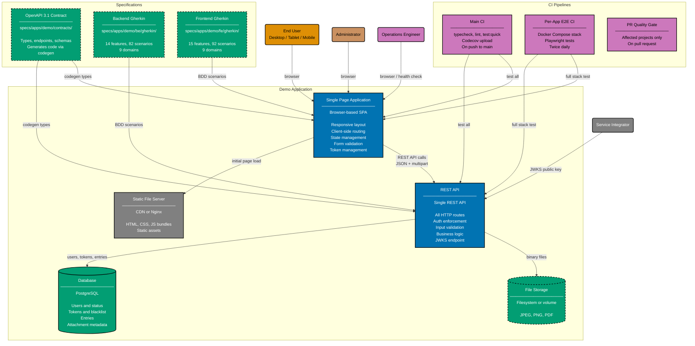

# Container Diagram: Demo Application

Level 2 of the C4 model. Shows the runtime containers inside the Demo Application system
boundary: the browser-based SPA, the static file server, the REST API, the database, file
storage, and the supporting infrastructure (CI pipelines, API contract, Gherkin specs).

The SPA runs in the user's browser. Build artifacts are served by a static file server (CDN, Nginx,
or framework dev server). All API calls go through the REST API to the database and file storage.
The token blacklist is stored inside the Database — no separate cache is required at demo scale.

Each container has multiple interchangeable implementations (shown below the diagram).

## Container Implementations

### REST API (11 implementations)

| App                       | Language   | Framework    | Database   | Coverage |
| ------------------------- | ---------- | ------------ | ---------- | -------- |
| demo-be-golang-gin        | Go         | Gin          | PostgreSQL | >= 90%   |
| demo-be-java-springboot   | Java       | Spring Boot  | PostgreSQL | >= 90%   |
| demo-be-java-vertx        | Java       | Vert.x       | PostgreSQL | >= 90%   |
| demo-be-kotlin-ktor       | Kotlin     | Ktor         | PostgreSQL | >= 90%   |
| demo-be-python-fastapi    | Python     | FastAPI      | PostgreSQL | >= 90%   |
| demo-be-rust-axum         | Rust       | Axum         | PostgreSQL | >= 90%   |
| demo-be-ts-effect         | TypeScript | Effect       | PostgreSQL | >= 90%   |
| demo-be-fsharp-giraffe    | F#         | Giraffe      | PostgreSQL | >= 90%   |
| demo-be-csharp-aspnetcore | C#         | ASP.NET Core | PostgreSQL | >= 90%   |
| demo-be-clojure-pedestal  | Clojure    | Pedestal     | PostgreSQL | >= 90%   |
| demo-be-elixir-phoenix    | Elixir     | Phoenix      | PostgreSQL | >= 90%   |

### Single Page Application (3 implementations)

| App                       | Language   | Framework      | Coverage |
| ------------------------- | ---------- | -------------- | -------- |
| demo-fe-ts-nextjs         | TypeScript | Next.js 16     | >= 70%   |
| demo-fe-ts-tanstack-start | TypeScript | TanStack Start | >= 70%   |
| demo-fe-dart-flutterweb   | Dart       | Flutter Web    | >= 70%   |

### E2E Test Suites

| App         | Targets         | Scope                       |
| ----------- | --------------- | --------------------------- |
| demo-be-e2e | All 11 backends | Playwright, per-backend CI  |
| demo-fe-e2e | All 3 frontends | Playwright, per-frontend CI |

## Related

- **Context diagram**: [context.md](./context.md)
- **Backend component diagram**: [component-be.md](./component-be.md)
- **Frontend component diagram**: [component-fe.md](./component-fe.md)
- **API contract**: [../contracts/openapi.yaml](../contracts/openapi.yaml)
- **Parent**: [demo specs](../README.md)
