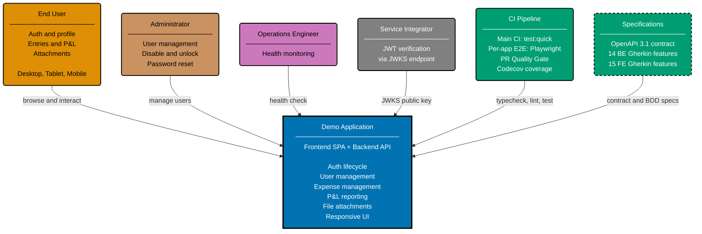

# Context Diagram: Demo Application

Level 1 of the C4 model. Shows the Demo Application as a single system with four external actors.
The system contains both the frontend SPA and backend REST API — this diagram treats them as one
boundary.

The system is implemented in 11 backend languages/frameworks and 3 frontend frameworks, all
conforming to a single OpenAPI 3.1 contract and shared Gherkin specifications.

## Implementations

The system boundary above contains 14 interchangeable implementations:

- **11 backends**: Go/Gin, Java/Spring Boot, Java/Vert.x, Kotlin/Ktor, Python/FastAPI,
  Rust/Axum, TypeScript/Effect, F#/Giraffe, C#/ASP.NET Core, Clojure/Pedestal,
  Elixir/Phoenix
- **3 frontends**: TypeScript/Next.js, TypeScript/TanStack Start, Dart/Flutter Web

Any backend can pair with any frontend — the OpenAPI contract guarantees compatibility.

## Related

- **Container diagram**: [container.md](./container.md)
- **Backend component diagram**: [component-be.md](./component-be.md)
- **Frontend component diagram**: [component-fe.md](./component-fe.md)
- **API contract**: [../contracts/openapi.yaml](../contracts/openapi.yaml)
- **Parent**: [demo specs](../README.md)
