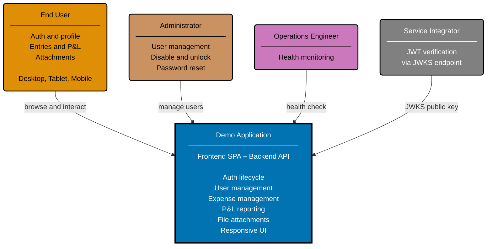

# Context Diagram: Demo Application

Level 1 of the C4 model. Shows the Demo Application as a single system with four external actors.
The system contains both the frontend SPA and backend REST API — this diagram treats them as one
boundary.

## Related

- **Container diagram**: [container.md](./container.md)
- **Backend component diagram**: [component-be.md](./component-be.md)
- **Frontend component diagram**: [component-fe.md](./component-fe.md)
- **Parent**: [demo specs](../README.md)
