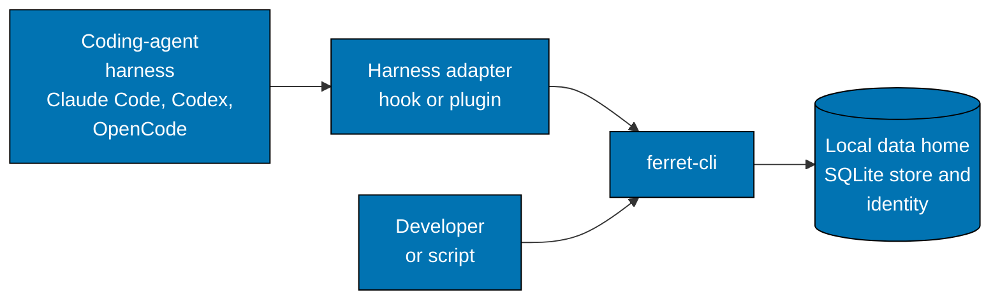
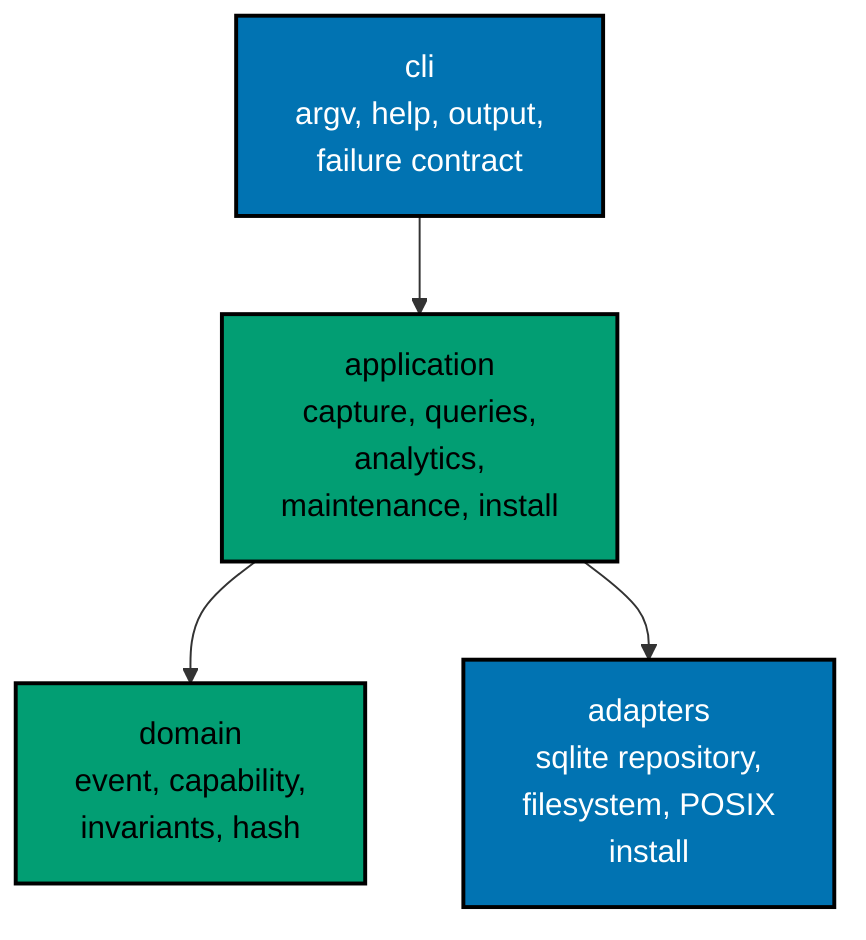

# FERRET CLI — Architecture

The current, as-built system. A change that alters an actor, a container, a component responsibility, a relationship,
or a boundary updates this document in the same delivery unit.

## Scope

`ferret-cli` records the lifecycle metadata of coding-agent harnesses — sessions, agents, skills, and tools — in one
private SQLite store on the machine, and answers questions about it. It never reaches the network, never blocks a
harness, and never stores content. Everything runs as short-lived local processes.

## System Context

Two kinds of caller share one binary. A harness adapter passes one bounded raw payload to `capture-hook` and ignores
the result; a developer or script runs the query and maintenance commands and reads their output. The adapter is a
boundary FERRET does not control, so it is designed to be unable to hurt the harness.

## Containers

| Container        | What it is                                                              | How it is reached                                     |
| ---------------- | ----------------------------------------------------------------------- | ----------------------------------------------------- |
| `ferret` zipapp  | one Python 3.14 archive with no third-party runtime dependency          | `python ferret.pyz`, or the per-user launcher symlink |
| Local data home  | the SQLite store in WAL mode, the installation identity, and its secret | read and written only by `ferret`                     |
| Harness adapters | a POSIX wrapper for Claude Code and Codex, and a plugin for OpenCode    | registered in each harness's own configuration        |
| Per-user install | the versioned artifact, a launcher symlink, and an ownership manifest   | `ferret self install`, `ferret self uninstall`        |

The data home is `~/.ferret` and is created owner-only. The per-user install lives under `~/.local/share/ferret/` with
its launcher in `~/.local/bin/`; installing never edits a shell startup file or `PATH`.

## Components

FERRET is ports-and-adapters. The command line is the driving adapter and composition root; the domain and application
layers know nothing of SQLite, the filesystem, or argv.

| Component     | Responsibility                                                                                       |
| ------------- | ---------------------------------------------------------------------------------------------------- |
| `cli`         | the closed command grammar, help and version, output rendering, and the closed failure contract      |
| `application` | privacy projection, canonical capture, queries and cursors, analytics, retention, and install policy |
| `domain`      | the event and capability types, their invariants, canonicalization, and the SHA-256 event hash       |
| `adapters`    | the SQLite repository, data-home resolution and permissions, and the POSIX installer                 |

## Privacy Boundary

The boundary sits at `capture-hook`. Only there is a raw vendor payload read, and it is reduced in memory to a closed
set of metadata fields before anything is written.

- **Kept:** harness, harness version, installation and workspace and session identifiers (opaque), event type, agent,
  skill, and tool names, outcome, duration, and three visibility markers that record whether each value was observed,
  derived, or unknown.
- **Never kept:** prompts, responses, tool arguments or results, transcripts, file contents, paths, or environment
  values. A payload field that could carry content is rejected, and the rejection names the field, never its value.
- **Opaque identifiers.** Workspace and session identifiers are derived with a per-installation secret held in the data
  home and never stored in the database or exported.

## Constraints

**Fail open.** The adapters and `capture-hook` always exit 0 and write nothing to stdout or stderr. A missing binary,
an invalid payload, a busy or full database, or a slow start ends within a fixed deadline and never delays a harness.

**Bounded, private storage.** Every object in the data home is owner-only, symbolic and hard links are refused, and the
store keeps no telemetry older than 30 days: reads exclude it first and a bounded prune removes it.

**Output is a contract.** Stdout carries data and stderr carries diagnostics, never mixed. Machine output is one
compact JSON object, and a failure names a closed code and never echoes a rejected value.

**No network.** Every command works with no backend present, and nothing opens a socket.

**macOS and Linux only.** No other platform is claimed, tested, or shipped.

## Related

- [`apps/ferret-cli/README.md`](../../../../apps/ferret-cli/README.md) — the implementing project.
- [Overview](../overview.md) — the product framing and the privacy promise.
