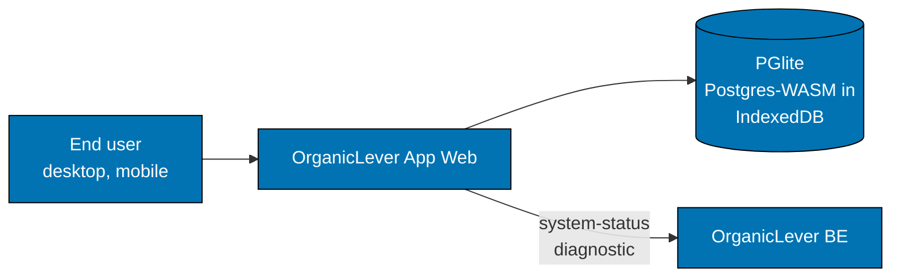

# OrganicLever App Web — Architecture

The current, as-built system. A change that alters an actor, a container, a component
responsibility, a relationship, or a boundary updates this document in the same delivery unit.

## Scope

OrganicLever App Web is a local-first life journal: a user logs workouts, reading, learning, meals,
and focus sessions, and reviews them over time. There is no account, no server write, and no sync.
The browser is the database.

## System Context

The only outbound call is the system-status diagnostic. Every user-visible write lands in PGlite, so
clearing browser storage destroys the journal — which is the deliberate cost of shipping without an
account.

## Containers

| Container              | Technology                       | Responsibility                                   |
| ---------------------- | -------------------------------- | ------------------------------------------------ |
| `organiclever-app-web` | Next.js 16, TypeScript, React 19 | every screen, and every write to the local store |
| PGlite                 | Postgres-WASM over IndexedDB     | journal, routine, and settings tables            |

## Components

The app is organized as feature contexts under `src/contexts/`, each with a functional core and an
imperative shell. Two state machines carry the flows that span screens:

| Machine                 | What it owns                                                        |
| ----------------------- | ------------------------------------------------------------------- |
| `appMachine`            | the navigation shell — which screen is active and what the FAB does |
| `workoutSessionMachine` | an active workout: set logging, the rest timer, and finishing       |

Effect TS sequences PGlite operations in the infrastructure layer, which is what keeps a multi-step
write from leaving the store half-updated.

## Constraints

**No network write.** Nothing a user logs leaves the device. A feature that needs a server changes
the product's privacy promise, not just its implementation.

**Append-only journal.** Every entry type — workout, reading, learning, meal, focus, and custom —
appends an immutable event to the shared log. Home, History, and Progress derive their views from
that log. A new entry type follows the same pattern rather than adding a separate table.

**Migrations run in the browser.** A schema change ships as a PGlite migration that must be
idempotent against a store the developer has never seen.

## Related

- [Behaviours](./behaviours/README.md) — the scenarios this system must satisfy.
- [`apps/organiclever-app-web/README.md`](../../../../apps/organiclever-app-web/README.md) — the implementing project.
