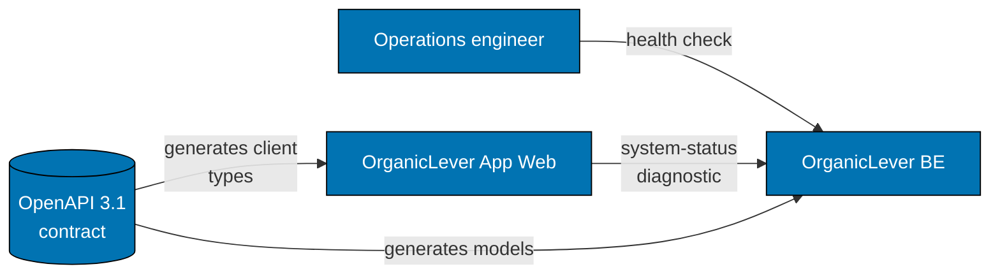

# OrganicLever BE — Architecture

The current, as-built system. A change that alters an actor, a container, a component
responsibility, a relationship, or a boundary updates this document in the same delivery unit.

## Scope

`organiclever-be` is the OrganicLever REST API. Today it ships exactly one route — the health
endpoint — and its purpose is to be the place the productivity-tracking API lands when the product
stops being local-only. Documenting it while it is one handler is what keeps the contract-first
chain honest before there is pressure on it.

## System Context

Both callers read the same contract, which is why a route's shape is a cross-project change rather
than a backend detail.

## Containers

| Container         | Technology  | Persistence | Coverage floor |
| ----------------- | ----------- | ----------- | -------------- |
| `organiclever-be` | F#, Giraffe | none        | 99% Unit lines |

There is no database, no migration set, and no repository layer today. That absence is deliberate:
the journal lives in the user's browser, so the service holds no user state at all.

## Components

One layer ships today.

| Component      | Responsibility                        |
| -------------- | ------------------------------------- |
| Health Handler | `GET /api/v1/health`, public, no auth |

There is no authentication middleware and no domain-service layer. A route that needs either is an
architectural change and updates this document.

## Constraints

**Contract first.** `codegen` generates F# models from
`contracts/generated/openapi-bundled.yaml`. A handler whose response diverges from the contract
fails the drift check rather than passing quietly.

**Every route is public.** There is no session, no token, and nothing to protect, because the
service stores nothing about a user. The first non-public route changes that and must say so here.

## Related

- [Behaviours](./behaviours/README.md) — the scenarios this system must satisfy.
- [Contracts](./contracts/README.md) — the OpenAPI document this service generates from.
- [`apps/organiclever-be/README.md`](../../../../apps/organiclever-be/README.md) — the implementing project.
