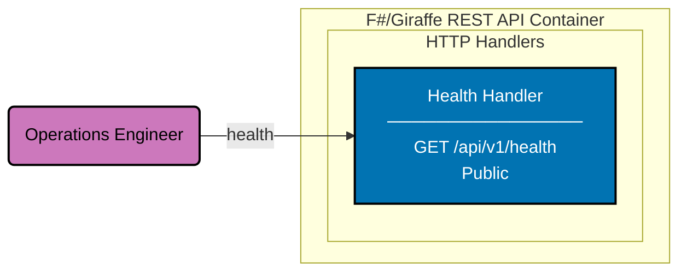

# Component Diagram: F#/Giraffe REST API

Level 3 of the C4 model. Shows the logical components inside the F#/Giraffe REST API container.
v0 ships only the health endpoint; future work will add productivity-tracking handlers.

All routes are public. There is no authentication middleware, no domain services, and no
infrastructure layer (no database, no migrations, no repositories) in v0.

## Gherkin Coverage by Component

Each component above is exercised by Gherkin features from
[`specs/apps/organiclever/be/gherkin/`](../be/gherkin/README.md):

| Component      | Gherkin Domain | Features         |
| -------------- | -------------- | ---------------- |
| Health Handler | health         | health-check (2) |

## Testing

| Level              | What                       | Gherkin             | Coverage |
| ------------------ | -------------------------- | ------------------- | -------- |
| `test:unit`        | Handler calls via TickSpec | Yes (all scenarios) | >= 90%   |
| `test:integration` | Handler calls via TickSpec | Yes (all scenarios) | N/A      |
| `test:e2e`         | Full HTTP via Playwright   | Yes (all scenarios) | N/A      |

## Related

- **Container diagram**: [container.md](./container.md)
- **Frontend component diagram**: [component-fe.md](./component-fe.md)
- **Backend gherkin specs**: [be/gherkin/](../be/gherkin/README.md)
- **Parent**: [organiclever specs](../README.md)
