# Component Diagram: F#/Giraffe REST API

Level 3 of the C4 model. Shows the logical components inside the F#/Giraffe REST API container.
Organised into four layers: HTTP handlers, middleware, domain services, and infrastructure
(repositories, database context, and migration tooling).

**Public routes** (health, google login) bypass JWT Middleware.
**Protected routes** pass through JWT Middleware before reaching their handler.

```mermaid
%% Color Palette: Blue #0173B2 | Orange #DE8F05 | Teal #029E73 | Purple #CC78BC | Brown #CA9161 | Gray #808080
graph LR
    EU("End User"):::actor
    OPS("Operations Engineer"):::actor_ops

    subgraph RESTAPI["F#/Giraffe REST API Container"]

        subgraph LAYER1["HTTP Handlers"]
            HH["Health Handler<br/>────────────────<br/>GET /health<br/>Public"]:::handler
            AH["Auth Handler<br/>────────────────<br/>POST /api/v1/auth/google<br/>POST /api/v1/auth/refresh<br/>GET /api/v1/auth/me<br/>Public: google, refresh<br/>Protected: me"]:::handler
        end

        subgraph LAYER2["Middleware"]
            JWTMW["JWT Middleware<br/>────────────────<br/>Validate access token<br/>All protected routes"]:::middleware
        end

        subgraph LAYER3["Domain Services"]
            GAS["GoogleAuthService<br/>────────────────<br/>Verify Google ID token<br/>Create or update user<br/>Issue token pair"]:::service
            JS["JwtService<br/>────────────────<br/>Issue access token<br/>Issue refresh token<br/>Validate access token<br/>Rotate refresh token"]:::service
        end

        subgraph LAYER4["Infrastructure"]
            UR["UserRepository<br/>────────────────<br/>Find by Google ID<br/>Create user<br/>Update user profile"]:::repo
            RTR["RefreshTokenRepository<br/>────────────────<br/>Save refresh token<br/>Find by token value<br/>Delete (rotation)"]:::repo
            DBC["AppDbContext<br/>────────────────<br/>Entity Framework Core<br/>PostgreSQL connection"]:::infra
            MIG["Migrator<br/>────────────────<br/>DbUp<br/>Runs on startup"]:::infra
        end

    end

    DB[("PostgreSQL")]:::datastore
    FE["Next.js Frontend"]:::external

    %% Public entry points
    OPS -->|"public: health"| HH
    EU -->|"public: google login, refresh"| AH

    %% Protected entry points through JWT Middleware
    EU -->|"protected: me"| JWTMW
    JWTMW -->|"profile route"| AH

    %% Handlers -> Services
    AH --> GAS
    AH --> JS
    JWTMW -->|"validate token"| JS

    %% Services -> Repositories
    GAS --> UR
    GAS --> RTR
    GAS --> JS
    JS --> RTR

    %% Repositories -> Infrastructure
    UR --> DBC
    RTR --> DBC
    DBC --> DB
    MIG --> DB

    classDef actor fill:#DE8F05,stroke:#000000,color:#000000,stroke-width:2px
    classDef actor_ops fill:#CC78BC,stroke:#000000,color:#000000,stroke-width:2px
    classDef handler fill:#0173B2,stroke:#000000,color:#FFFFFF,stroke-width:2px
    classDef middleware fill:#CC78BC,stroke:#000000,color:#000000,stroke-width:2px
    classDef service fill:#0173B2,stroke:#000000,color:#FFFFFF,stroke-width:2px
    classDef repo fill:#029E73,stroke:#000000,color:#FFFFFF,stroke-width:2px
    classDef infra fill:#808080,stroke:#000000,color:#FFFFFF,stroke-width:2px
    classDef datastore fill:#029E73,stroke:#000000,color:#FFFFFF,stroke-width:2px
    classDef external fill:#808080,stroke:#000000,color:#FFFFFF,stroke-width:2px,stroke-dasharray:5 5
```

## Gherkin Coverage by Component

Each component above is exercised by Gherkin features from
[`specs/apps/organiclever/be/gherkin/`](../be/gherkin/README.md):

| Component                        | Gherkin Domain | Features         |
| -------------------------------- | -------------- | ---------------- |
| Health Handler                   | health         | health-check (2) |
| Auth Handler + GoogleAuthService | authentication | google-login (6) |
| Auth Handler + JwtService        | authentication | me (3)           |
| JWT Middleware + JwtService      | authentication | me (3)           |

## Testing

| Level              | What                           | Gherkin             | Coverage |
| ------------------ | ------------------------------ | ------------------- | -------- |
| `test:unit`        | Service calls, mocked repos    | Yes (all scenarios) | >= 90%   |
| `test:integration` | Service calls, real PostgreSQL | Yes (all scenarios) | N/A      |
| `test:e2e`         | Full HTTP via Playwright       | Yes (all scenarios) | N/A      |

## Related

- **Container diagram**: [container.md](./container.md)
- **Frontend component diagram**: [component-fe.md](./component-fe.md)
- **Backend gherkin specs**: [be/gherkin/](../be/gherkin/README.md)
- **Parent**: [organiclever specs](../README.md)
