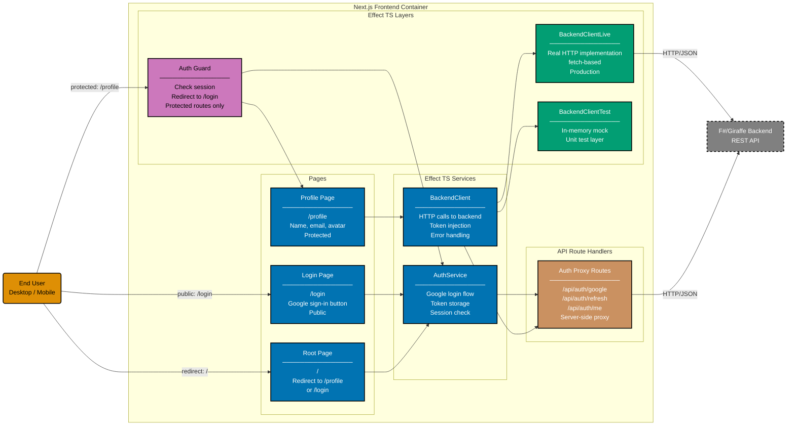

# Component Diagram: Next.js Frontend

Level 3 of the C4 model. Shows the logical components inside the Next.js 16 frontend container.
Organised into four layers: pages, API route handlers, Effect TS services, and Effect TS layers
(dependency injection).

**Public pages** (/login) bypass Auth Guard.
**Protected pages** (/profile) pass through Auth Guard before rendering.
**Root page** (/) redirects based on authentication state.

## Gherkin Coverage by Component

Each component above is exercised by Gherkin features from
[`specs/apps/organiclever/fe/gherkin/`](../fe/gherkin/README.md):

| Component                    | Gherkin Domain | Features             |
| ---------------------------- | -------------- | -------------------- |
| Login Page + AuthService     | authentication | google-login (2)     |
| Profile Page + BackendClient | authentication | profile (2)          |
| Auth Guard + Root Page       | authentication | route-protection (4) |
| All pages                    | layout         | accessibility (5)    |

## Testing

| Level       | What                        | Gherkin             | Coverage |
| ----------- | --------------------------- | ------------------- | -------- |
| `test:unit` | Component logic, mocked API | Yes (all scenarios) | >= 70%   |
| `test:e2e`  | Full browser via Playwright | Yes (all scenarios) | N/A      |

## Related

- **Container diagram**: [container.md](./container.md)
- **Backend component diagram**: [component-be.md](./component-be.md)
- **Frontend gherkin specs**: [fe/gherkin/](../fe/gherkin/README.md)
- **Parent**: [organiclever specs](../README.md)
