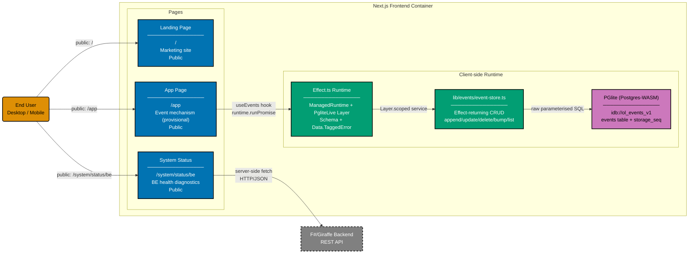

# Component Diagram: Next.js Frontend

Level 3 of the C4 model. Shows the logical components inside the Next.js 16 frontend container.
v0 has no authenticated screens. The frontend ships:

- **Landing page** (`/`) — marketing copy, "Open the app" CTA, principles, weekly-rhythm demo.
- **System status page** (`/system/status/be`) — diagnostic dashboard polling the backend
  `/api/v1/health` endpoint server-side.
- **App page** (`/app`) — provisional client-side event-mechanism page; PGlite-backed
  CRUD with Effect.ts runtime, `Schema`-validated drafts, and discriminated typed
  errors. Landed by the gear-up plan; the bigger app plan replaces this with the
  full app shell (TabBar / SideNav / typed loggers) on top of the same PGlite store.
- **404 fallbacks** for `/login` and `/profile` — guards against accidental re-introduction of
  Google auth UI.

## Gherkin Coverage by Component

Each component above is exercised by Gherkin features from
[`specs/apps/organiclever/fe/gherkin/`](../fe/gherkin/README.md):

| Component                                | Gherkin Domain | Features         |
| ---------------------------------------- | -------------- | ---------------- |
| Landing Page                             | landing        | landing          |
| System Status Page                       | system         | system-status-be |
| All pages                                | layout         | accessibility    |
| `/login` + `/profile` 404s               | routing        | disabled-routes  |
| App Page + PGlite + Effect runtime/store | events         | events-mechanism |

## Testing

| Level       | What                        | Gherkin             | Coverage |
| ----------- | --------------------------- | ------------------- | -------- |
| `test:unit` | Component logic, mocked API | Yes (all scenarios) | >= 70%   |
| `test:e2e`  | Full browser via Playwright | Yes (all scenarios) | N/A      |

## Related

- **Container diagram**: [container.md](./container.md)
- **Backend component diagram**: [component-be.md](./component-be.md)
- **Frontend gherkin specs**: [fe/gherkin/](../fe/gherkin/README.md)
- **Parent**: [organiclever specs](../README.md)
