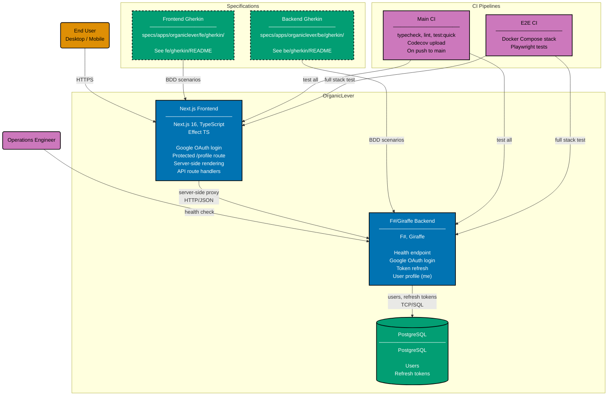

# Container Diagram: OrganicLever

Level 2 of the C4 model. Shows the runtime containers inside the OrganicLever system boundary:
the Next.js 16 frontend, the F#/Giraffe backend REST API, and the PostgreSQL database.

The frontend runs server-side in Next.js. Protected page routes proxy API calls to the backend
via Next.js API route handlers. All authentication and data storage flows through the backend to
the database.

## Container Implementations

### Backend

| App             | Language | Framework | Database   | Coverage |
| --------------- | -------- | --------- | ---------- | -------- |
| organiclever-be | F#       | Giraffe   | PostgreSQL | >= 90%   |

### Frontend

| App             | Language   | Framework  | Coverage |
| --------------- | ---------- | ---------- | -------- |
| organiclever-fe | TypeScript | Next.js 16 | >= 70%   |

## Related

- **Context diagram**: [context.md](./context.md)
- **Backend component diagram**: [component-be.md](./component-be.md)
- **Frontend component diagram**: [component-fe.md](./component-fe.md)
- **Parent**: [organiclever specs](../README.md)
