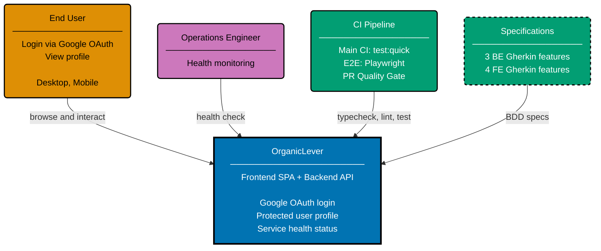

# Context Diagram: OrganicLever

Level 1 of the C4 model. Shows the OrganicLever system as a single boundary with two external
actors. The system contains both the Next.js frontend and the F#/Giraffe backend REST API.

## Related

- **Container diagram**: [container.md](./container.md)
- **Backend component diagram**: [component-be.md](./component-be.md)
- **Frontend component diagram**: [component-fe.md](./component-fe.md)
- **Parent**: [organiclever specs](../README.md)
